# AI 核心概念从头梳理

> **视频来源**：[AI的核心概念从头梳理 | LLM、Prompt、Agent、RAG、MCP、Skill、Context、Harness Engineering](https://www.bilibili.com/video/BV1wydDBDEuC)  
> **作者**：御豪同学 | **发布**：2026-04-22 | **时长**：49:08

---

## 一、核心框架：三层架构

理解所有 AI 概念的钥匙是 **"模型 + 工程 + 应用"** 三层架构：

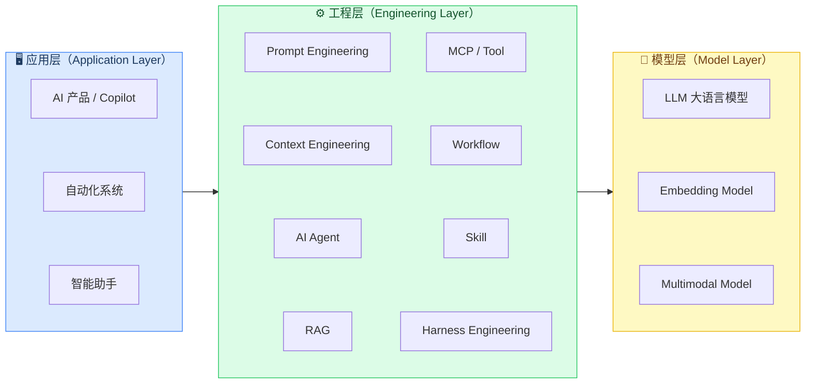

---

## 二、大模型的本质：一个函数

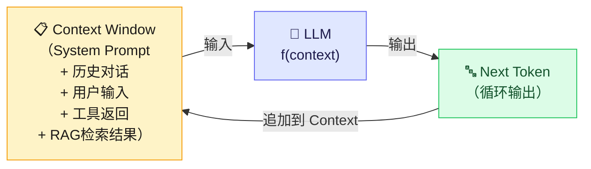

> **核心洞察**：模型本身无状态，所有"智能"体现都依赖 Context 的质量。

---

## 三、Prompt → Context Engineering 演进

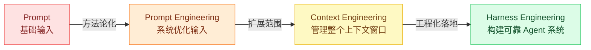

---

## 四、AI Agent 架构（ReAct 循环）

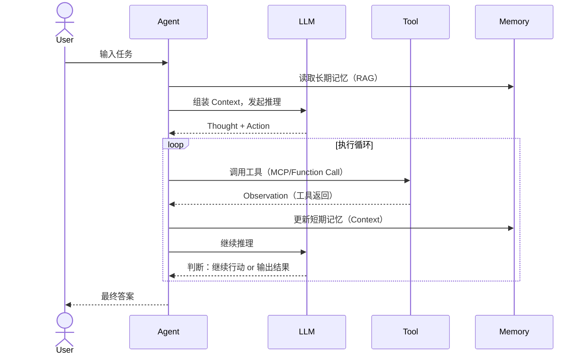

---

## 五、Memory 体系：短期 vs 长期

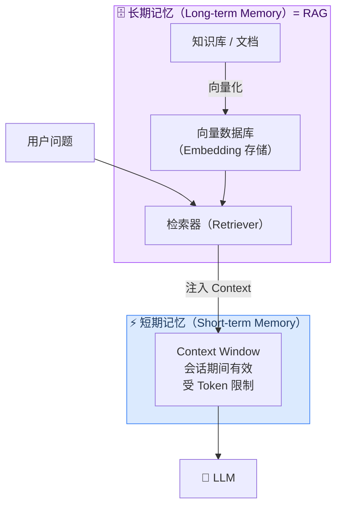

---

## 六、RAG 完整工作流

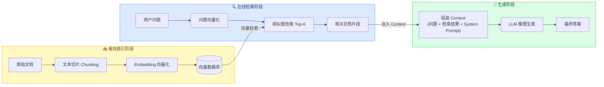

---

## 七、MCP 协议架构

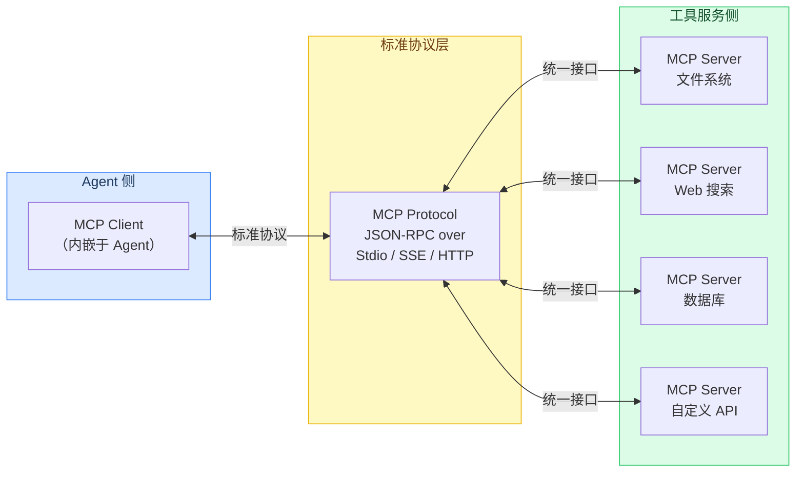

> MCP 之于 AI 工具，就像 **USB 协议之于外设**：统一标准，即插即用。

---

## 八、Tool 调用机制

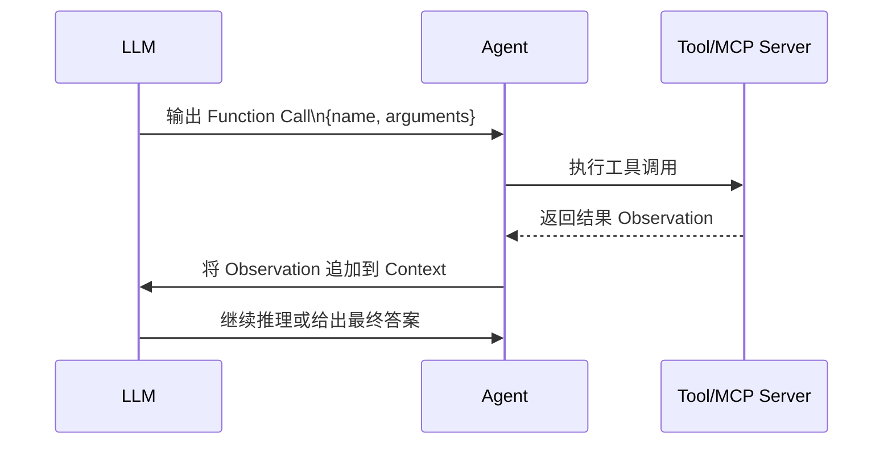

---

## 九、Skill 封装结构

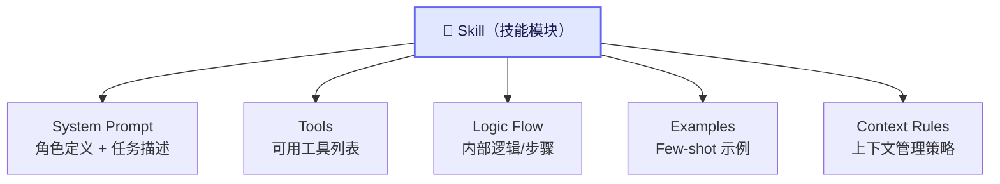

---

## 十、Harness Engineering 体系

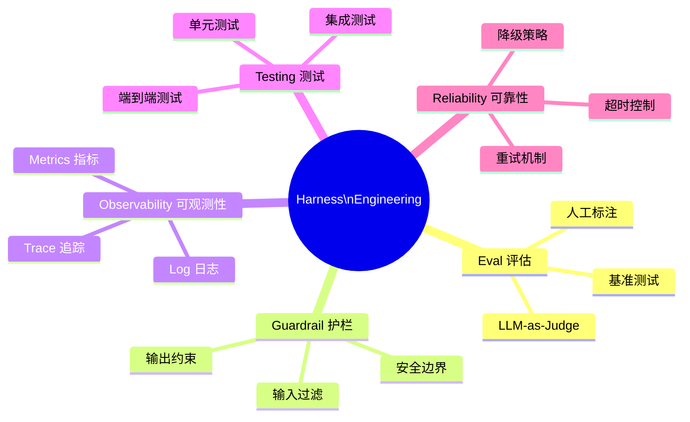

---

## 十一、全局概念关系图

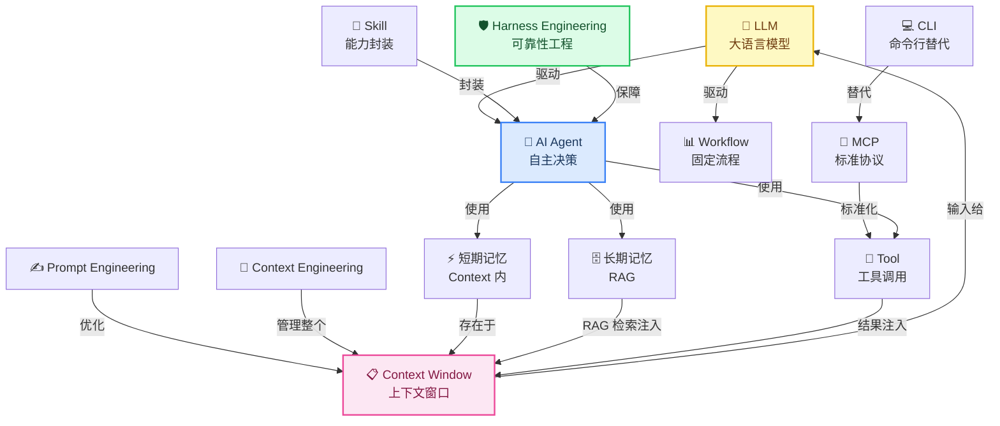

---

## 十二、关键结论

| 概念 | 所属层 | 核心作用 |
|------|--------|----------|
| LLM | 模型层 | 语言理解与生成的核心引擎 |
| Prompt Engineering | 工程层 | 优化单次输入质量 |
| Context Engineering | 工程层 | 管理整个上下文窗口的内容 |
| RAG | 工程层 | 为模型提供长期/外部知识 |
| Tool / MCP | 工程层 | 扩展模型与外部世界的交互 |
| AI Agent | 工程/应用层 | 自主规划和执行复杂任务 |
| Skill | 工程/应用层 | 将特定能力模块化封装复用 |
| Harness Engineering | 工程层 | 让 Agent 系统从能用变为可靠 |

**技术演进主线**：
```
Prompt → Prompt Engineering → Context Engineering → Harness Engineering
工具调用 → Function Calling → MCP（标准化协议）
单次对话 → Workflow（固定流程）→ Agent（动态决策）
```

---

*整理时间：2026-06-07*
