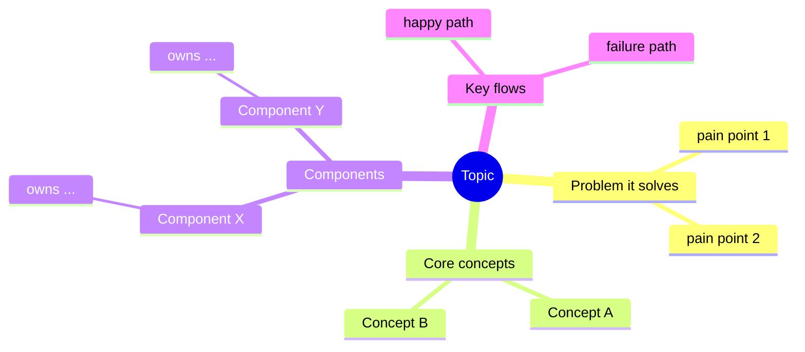

# Cognitive Mental Model — Learning New Systems in Software Engineering

## Core insight

Every new concept, system, or open-source project in software engineering exists **to solve a problem**. Understanding it is not memorizing its API or its buzzwords — it is reconstructing the chain of reasoning that led from the problem to the design. This skill encodes that chain as a fixed four-stage progression:

```
WHY  →  WHAT  →  HOW  →  WALKTHROUGH
(problem)  (definition)  (design)   (see it run)
```

Never skip a stage and never reorder them. Each stage answers the question the reader naturally has after the previous one.

---

## Stage 1 — WHY: The problem it solves

Before defining anything, establish the *pain*. A definition without a problem is noise; a problem makes the definition inevitable.

Answer, in order:

1. **What was the world like before this existed?** Describe the concrete pain: what broke, what was slow, what didn't scale, what was error-prone.
2. **Why were existing solutions not enough?** Name the predecessors or alternatives and the specific limitation of each.
3. **What constraints shaped the solution?** (performance, consistency, developer ergonomics, cost, compatibility…)

**Quality bar:** After reading the Why section, the reader should be able to say *"if this thing didn't exist, someone would have to invent it"* — and roughly predict what it must do.

**Anti-patterns:** starting with the definition; listing features before pain; vague claims like "it makes things easier" without saying easier *than what*.

---

## Stage 2 — WHAT: Definition and boundaries

Now — and only now — define it.

1. **One-sentence definition.** One sentence, no jargon that hasn't been introduced. Formula: *"X is a [category] that [solves the Stage-1 problem] by [core mechanism, named but not yet explained]."*
2. **Boundaries.** What it is **not**, and what it deliberately does not try to do. Boundaries prevent the most common misuse of any technology.
3. **Position in the ecosystem.** What it sits on top of, what sits on top of it, and its closest neighbors/competitors (one line each on how it differs).

**Quality bar:** The reader can now correctly classify the thing and decide whether it is relevant to their problem — even before knowing how it works.

---

## Stage 3 — HOW: Design and implementation (the heart)

This is the most important stage and deserves the most space. A reader who understands *how* the solution is designed owns a durable mental model; everything else can be looked up.

Structure the How in three fixed steps:

### 3.1 Domain mapping — from problem to concepts

Every well-designed system **maps the problem domain onto its own set of concepts**. List each core concept and show the mapping explicitly:

| Real-world problem element | System concept | Why this abstraction |
|---|---|---|
| e.g. "a stream of business events" | Kafka *Topic* | ordered, replayable, decoupled from consumers |

Rules:
- Keep the concept list minimal — 4 to 8 concepts. If a system seems to have twenty, find the core few and mark the rest as derived.
- For each concept give: name, one-line definition, and the problem element it represents.
- Introduce concepts in **dependency order**: never mention a concept before the ones it builds on.

### 3.2 Responsibility assignment — from concepts to components

Show how the design **assigns distinct responsibilities to distinct components**. For each component:

- **Owns:** the one responsibility it is in charge of (single-responsibility framing).
- **Knows:** what state or information it holds.
- **Does not do:** the tempting responsibility it deliberately avoids — this is where design elegance lives.

A clean responsibility table is often the single most clarifying artifact in the entire guide.

### 3.3 Coordination — components working together

Finally, show how the components **coordinate to solve the original problem end to end**:

- Trace the primary flow (the "happy path") step by step: what triggers what, what data moves where, in what order.
- **Draw the flow — a diagram here is mandatory, not decorative.** For any non-trivial workflow, a **sequence flow diagram** must show the relationships and interoperation between components: who calls whom, in what order, with what data. Use Mermaid (`sequenceDiagram` / `flowchart`) for simple flows; for complicated flows — many participants, branching, retries, async fan-out, cross-boundary hops — produce a **draw.io (`.drawio`) file** instead, where layout, grouping, and annotations can be controlled precisely. (Full rules in "Visualization requirements" below.)
- Cover the one or two most important failure/edge flows (what happens when a node dies, a message is duplicated, a cache misses…), because coordination under failure is usually the *reason* the design looks the way it does.

**Quality bar:** The reader could now sketch the architecture on a whiteboard from memory and justify each component's existence by pointing back to the Stage-1 problem.

---

## Stage 4 — WALKTHROUGH: One comprehensive, concrete example

End with a single end-to-end example that **touches every concept and every component introduced above**. This converts abstract understanding into vivid, instant recall.

Requirements:
- Pick one realistic, relatable scenario (an order being placed, a request being served, a file being committed…).
- Narrate it chronologically: *"The user clicks X → component A does … → concept B is created … → component C picks it up …"*
- At each step, **name the concept/component in bold** the first time it appears in action, so the reader mentally checks it off.
- Show real artifacts where possible: actual commands, config snippets, log lines, or a short runnable code sample.
- Close with a one-paragraph recap that restates the Stage-1 problem and how the walkthrough just solved it.

**Quality bar:** After the walkthrough, every term from Stage 3 has been *seen doing its job* at least once.

---

## Output format: the guide pack

When the deliverable is a learning guide (not just a chat explanation), produce a pack of markdown files, one per stage, so readers can progress step by step:

```
<topic>-guide/
├── 00-overview.md      # roadmap + MANDATORY concept/component mindmap (see below)
├── 01-why.md           # Stage 1 — the problem
├── 02-what.md          # Stage 2 — definition, boundaries, ecosystem
├── 03-how.md           # Stage 3 — concepts, components, coordination + flow diagrams
│                       #   (split into 03a/03b/03c if it exceeds ~300 lines)
├── 04-walkthrough.md   # Stage 4 — end-to-end example (reuse/extend the 03 diagrams)
├── 05-next-steps.md    # optional: exercises, further reading, source-code entry points
└── diagrams/           # any .drawio sources for complicated diagrams
```

Conventions:
- Every file starts with a 2–3 line "Where you are / what you'll know after this file" header and ends with a link to the next file.
- Define each term exactly once, in its dependency-order position; later files link back rather than redefine.
- Prefer diagrams and tables over prose walls; prefer one deep example over three shallow ones.

## Visualization requirements

Visuals are first-class output of this skill, not decoration. Three rules:

### 1. Mindmap outline of all concepts & components — MANDATORY

Every guide pack **must** open (in `00-overview.md`) with a mindmap that outlines *all* core concepts and components in one glance, so the reader holds the whole territory in mind before entering it. Structure it by the skill's own anatomy:



Use Mermaid `mindmap` by default. If the map grows beyond ~25 nodes or needs cross-links between branches, build it in draw.io instead and commit the `.drawio` source to `diagrams/`.

### 2. Sequence/flow diagrams for workflows — required when a workflow is non-trivial

Whenever a workflow involves more than two components interacting, prose alone is insufficient: draw a **sequence flow** showing the relationships and interoperation (who calls whom, in what order, sync vs async, what data crosses each hop).

Tool choice:
- **Mermaid** (`sequenceDiagram`, `flowchart`, `stateDiagram-v2`) for simple cases — up to roughly 6 participants and a mostly linear flow. It renders inline in markdown, which readers get for free.
- **draw.io** (`.drawio` file in `diagrams/`, export a `.png`/`.svg` and embed it in the markdown) for complicated cases — many participants, nested branching, retry/timeout loops, async fan-out/fan-in, swim-lanes across process or network boundaries. When Mermaid would produce spaghetti, switch to draw.io and use manual layout, grouping boxes, and annotations to keep it legible.

Every diagram gets a one-line caption stating what question it answers (e.g. *"How a write becomes durable across replicas"*).

### 3. Visualize wherever it aids cognition

Beyond the two mandatory cases, add a diagram anywhere a picture beats a paragraph. Common wins:
- **Ecosystem/positioning map** in Stage 2 (what it sits on, what sits on it, neighbors).
- **Architecture/layer diagram** for the component overview in 3.2.
- **State diagram** (`stateDiagram-v2`) for anything with a lifecycle (a message, a transaction, a container).
- **Before/after comparison** in Stage 1 to make the pain visible.
- **Annotated walkthrough diagram** in Stage 4: reuse the Stage-3 flow diagram with the concrete example's data overlaid on each hop.

Rule of thumb: if you find yourself writing "A sends X to B, then B forwards Y to C…", stop and draw it.

## Adapting depth to the reader

- **Quick chat explanation:** compress each stage to a paragraph, keep the order.
- **Beginner audience:** expand Stage 1 (more analogy, more pain) and Stage 4 (slower narration); compress 3.2.
- **Experienced engineers:** compress Stages 1–2 to a few lines each; spend almost everything on Stage 3, especially "does not do" and failure coordination.
- **Codebase/project onboarding:** in Stage 3, map concepts to actual directories/modules, and in Stage 4 walk through a real request or commit path in the source.

## Checklist before delivering

- [ ] Why comes before What; What comes before How; the example comes last.
- [ ] The one-sentence definition references the Stage-1 problem.
- [ ] 4–8 core concepts, introduced in dependency order.
- [ ] Every component has an "owns / knows / does not do" entry.
- [ ] `00-overview.md` contains the mandatory mindmap covering all concepts and components.
- [ ] Every non-trivial workflow has a sequence/flow diagram (Mermaid if simple, draw.io if complicated), each with a one-line caption.
- [ ] At least one failure/edge flow is diagrammed or traced.
- [ ] The walkthrough exercises every concept and component at least once.
- [ ] Nothing is defined twice; nothing is used before it is defined.
- [ ] No "A sends X to B, then B forwards to C…" paragraphs left undrawn.