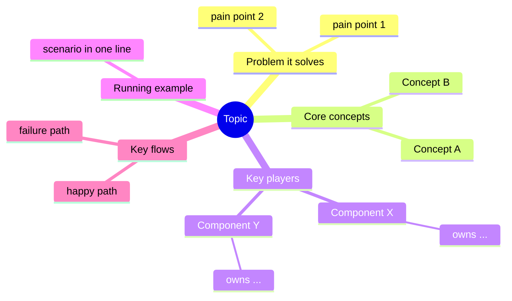

# Cognitive Mental Model — Learning New Systems in Software Engineering

## Core insight

Every new concept, system, or open-source project in software engineering exists **to solve a problem**. Understanding it is not memorizing its API or its buzzwords — it is reconstructing the chain of reasoning that led from the problem to the design.

The mental path is **breadth first, then depth, held together by one running example**:

```
WHY → WHAT → CONCEPT MAP → RUNNING EXAMPLE → DEPTH DIVES → FULL WALKTHROUGH
(problem) (definition) (breadth: all      (one scenario,    (one dive per key   (re-run the example
                        concepts &        traced shallowly)  player component,   end-to-end at
                        components)                          anchored to the     full depth)
                                                             example)
```

The reader first sees the whole territory (concepts), then meets one concrete scenario (example), then descends into each key player component **with the example as the anchor**, and finally re-runs the example end to end with full depth. Never skip a stage and never reorder them.

---

## Stage 1 — WHY: The problem it solves

Before defining anything, establish the *pain*. A definition without a problem is noise; a problem makes the definition inevitable.

Answer, in order:

1. **What was the world like before this existed?** Describe the concrete pain: what broke, what was slow, what didn't scale, what was error-prone.
2. **Why were existing solutions not enough?** Name the predecessors or alternatives and the specific limitation of each.
3. **What constraints shaped the solution?** (performance, consistency, developer ergonomics, cost, compatibility…)

**Quality bar:** After reading the Why section, the reader should be able to say *"if this thing didn't exist, someone would have to invent it"* — and roughly predict what it must do.

**Anti-patterns:** starting with the definition; listing features before pain; vague claims like "it makes things easier" without saying easier *than what*.

---

## Stage 2 — WHAT: Definition and boundaries

Now — and only now — define it.

1. **One-sentence definition.** One sentence, no jargon that hasn't been introduced. Formula: *"X is a [category] that [solves the Stage-1 problem] by [core mechanism, named but not yet explained]."*
2. **Boundaries.** What it is **not**, and what it deliberately does not try to do. Boundaries prevent the most common misuse of any technology.
3. **Position in the ecosystem.** What it sits on top of, what sits on top of it, and its closest neighbors/competitors (one line each on how it differs).

**Quality bar:** The reader can now correctly classify the thing and decide whether it is relevant to their problem — even before knowing how it works.

---

## Stage 3 — CONCEPT MAP: The whole territory, breadth first

Lay out **all core concepts and all key player components in one pass, at one shallow level of depth**. No deep internals yet — the goal is that the reader holds the complete map in mind before descending anywhere. Three fixed steps:

### 3.1 Domain mapping — from problem to concepts

Every well-designed system **maps the problem domain onto its own set of concepts**. List each core concept and show the mapping explicitly:

| Real-world problem element | System concept | Why this abstraction |
|---|---|---|
| e.g. "a stream of business events" | Kafka *Topic* | ordered, replayable, decoupled from consumers |

Rules:
- Keep the concept list minimal — 4 to 8 concepts. If a system seems to have twenty, find the core few and mark the rest as derived.
- For each concept give: name, one-line definition, and the problem element it represents.
- Introduce concepts in **dependency order**: never mention a concept before the ones it builds on.

### 3.2 Key players — from concepts to components

Identify the **key player components** and give each a one-paragraph identity (no internals yet):

- **Owns:** the one responsibility it is in charge of (single-responsibility framing).
- **Knows:** what state or information it holds.
- **Does not do:** the tempting responsibility it deliberately avoids — this is where design elegance lives.

This table doubles as the **table of contents for the depth dives** in Stage 5: every key player listed here gets its own dive.

### 3.3 Coordination at a glance

Show, at overview level, how the players **coordinate to solve the original problem end to end**: the happy-path flow, who calls whom, in what order, with what data — as **one diagram** (mandatory; see "Visualization requirements"). Mention the one or two most important failure/edge flows by name, deferring their mechanics to the depth dives.

**Quality bar:** The reader could now sketch the whole architecture on a whiteboard and justify each component's existence — without yet knowing how any single component works inside.

---

## Stage 4 — RUNNING EXAMPLE: One scenario becomes the spine

Immediately after the concept map, introduce **one realistic, relatable scenario** (an order being placed, a request being served, a file being committed…) and trace it **shallowly** through the map: *"The user clicks X → **Component A** receives it → a **Concept B** is created → **Component C** picks it up…"* — bolding each concept/component the first time it appears in action.

This example is not a one-off illustration; it is the **spine of the entire guide**:
- Every depth dive in Stage 5 must reference it ("recall step 3 of our example — here is what actually happens inside…").
- The final walkthrough in Stage 6 re-runs it at full depth.
- Choose it carefully: it must be rich enough to touch **every concept and every key player** at least once, yet simple enough to state in three sentences.

**Quality bar:** The reader can retell the scenario from memory and name which component is on stage at each step — even though they don't yet know any component's internals.

---

## Stage 5 — DEPTH DIVES: Go deep into each key player, anchored to the example

Now descend. **One dive per key player component** from the 3.2 table, in the order they appear in the running example. Each dive follows the same internal shape:

1. **Role recap (2 lines):** what it owns, restated from 3.2, plus which steps of the running example it appears in.
2. **Internal design:** its own sub-concepts, data structures, and algorithms; how it fulfills the responsibility it owns. Apply the same domain-mapping discipline recursively if the component is itself complex.
3. **Interactions:** its contracts with neighboring components — inputs, outputs, protocols, guarantees. Diagram any non-trivial interaction.
4. **⚓ Back to the example (mandatory anchor):** replay the component's moments in the running example at full depth — *"at step 3, when the order event arrives, this component does exactly: …"* — with real artifacts where possible (commands, config, log lines, code).
5. **Failure behavior:** what happens when it dies, lags, or receives garbage — and how the design copes.

Rules:
- Dives are **self-contained branches**: a reader can read one dive alone, because the recap and the anchor tie it back to the trunk.
- Depth is proportional to importance: a key player at the heart of the design gets a long dive; a supporting player gets a short one. Do not pad.
- Every dive must contain at least one "⚓ Back to the example" section. A dive without the anchor is floating knowledge — reject it.

**Quality bar:** After each dive, the reader can re-narrate the component's steps in the running example *including what happens inside*, not just that "it handles it".

---

## Stage 6 — FULL WALKTHROUGH: Re-run the example end to end

Close by re-running the running example **once, end to end, at full depth** — stitching all the dives into one continuous narrative:

- Narrate chronologically, crossing component boundaries explicitly: what data crosses each hop, what each component does inside (now known from the dives), what comes out.
- Reuse the Stage-3 coordination diagram with the example's concrete data annotated on each hop.
- Show real artifacts: actual commands, payloads, log excerpts, or a short runnable code sample tracing the whole path.
- Close with a one-paragraph recap that restates the Stage-1 problem and how the walkthrough just solved it.

**Quality bar:** Every concept and every component has now been *seen doing its job in full depth* at least once, all in a single connected story.

---

## Output format: an organically organized guide pack

When the deliverable is a learning guide (not just a chat explanation), produce a pack of markdown files. The pack is organized **organically**: a fixed trunk carries the shared mental path, and the branches **grow to mirror the system's own anatomy** — one deep-dive file per key player, named after the component, added or split as the system demands rather than forced into a fixed template.

```
<topic>-guide/
├── 00-overview.md                 # roadmap + MANDATORY concept/component mindmap
├── 01-why.md                      # Stage 1 — the problem
├── 02-what.md                     # Stage 2 — definition, boundaries, ecosystem
├── 03-concept-map.md              # Stage 3 — all concepts & key players, coordination at a glance
├── 04-running-example.md          # Stage 4 — the spine scenario, traced shallowly
├── 05-deep-dives/                 # Stage 5 — branches grow with the system
│   ├── 01-<key-player-a>.md       #   one file per key player, in example order
│   ├── 02-<key-player-b>.md       #   split a file into a sub-folder if a player
│   └── ...                        #   is itself a subsystem (recurse the pattern)
├── 06-walkthrough.md              # Stage 6 — the example re-run end to end, full depth
├── 07-next-steps.md               # optional: exercises, further reading, source entry points
└── diagrams/                      # .drawio sources for complicated diagrams
```

Organic-organization principles:
- **Structure mirrors anatomy.** The number and names of deep-dive files come from the system's actual key players (the 3.2 table), never from a quota. A system with 3 key players gets 3 dives; one with 7 gets 7.
- **Grow depth only where the system has depth.** If a key player is itself a subsystem, turn its dive into a sub-folder and recurse the whole pattern (mini concept-map → mini dives) inside it.
- **The running example is the connective tissue.** Trunk files introduce it; every branch anchors back to it; the walkthrough closes it. A reader can jump into any branch and still find their way back to the trunk via the anchor.
- **Self-contained but rooted.** Every file starts with a 2–3 line "Where you are / what you'll know after this file" header and ends with links to the next file and back to the concept map.
- Define each term exactly once, in its dependency-order position; later files link back rather than redefine.
- Prefer diagrams and tables over prose walls; prefer one deep example over three shallow ones.

## Visualization requirements

Visuals are first-class output of this skill, not decoration. Three rules:

### 1. Mindmap outline of all concepts & components — MANDATORY

Every guide pack **must** open (in `00-overview.md`) with a mindmap that outlines *all* core concepts and components in one glance, so the reader holds the whole territory in mind before entering it. Structure it by the skill's own anatomy:



Use Mermaid `mindmap` by default. If the map grows beyond ~25 nodes or needs cross-links between branches, build it in draw.io instead and commit the `.drawio` source to `diagrams/`.

### 2. Sequence/flow diagrams for workflows — required when a workflow is non-trivial

Whenever a workflow involves more than two components interacting, prose alone is insufficient: draw a **sequence flow** showing the relationships and interoperation (who calls whom, in what order, sync vs async, what data crosses each hop). This applies to the Stage-3 coordination overview, non-trivial interactions inside depth dives, and the Stage-6 walkthrough.

Tool choice:
- **Mermaid** (`sequenceDiagram`, `flowchart`, `stateDiagram-v2`) for simple cases — up to roughly 6 participants and a mostly linear flow. It renders inline in markdown, which readers get for free.
- **draw.io** (`.drawio` file in `diagrams/`, export a `.png`/`.svg` and embed it in the markdown) for complicated cases — many participants, nested branching, retry/timeout loops, async fan-out/fan-in, swim-lanes across process or network boundaries. When Mermaid would produce spaghetti, switch to draw.io and use manual layout, grouping boxes, and annotations to keep it legible.

Every diagram gets a one-line caption stating what question it answers (e.g. *"How a write becomes durable across replicas"*).

### 3. Visualize wherever it aids cognition

Beyond the two mandatory cases, add a diagram anywhere a picture beats a paragraph. Common wins:
- **Ecosystem/positioning map** in Stage 2 (what it sits on, what sits on it, neighbors).
- **Architecture/layer diagram** for the key-player overview in 3.2.
- **State diagram** (`stateDiagram-v2`) for anything with a lifecycle (a message, a transaction, a container).
- **Before/after comparison** in Stage 1 to make the pain visible.
- **Component-internals diagram** inside each depth dive when the internal design has moving parts.
- **Annotated walkthrough diagram** in Stage 6: reuse the Stage-3 coordination diagram with the concrete example's data overlaid on each hop.

Rule of thumb: if you find yourself writing "A sends X to B, then B forwards Y to C…", stop and draw it.

## Adapting depth to the reader

- **Quick chat explanation:** compress each stage to a paragraph, keep the order — including a mini running example and at least a sentence of depth per key player.
- **Beginner audience:** expand Stage 1 (more analogy, more pain) and Stage 4 (slower narration); keep dives short and lean harder on the "⚓ Back to the example" anchors.
- **Experienced engineers:** compress Stages 1–2 to a few lines each; spend almost everything on Stage 5, especially "does not do", internals, and failure behavior.
- **Codebase/project onboarding:** in Stage 3, map concepts to actual directories/modules; make each depth dive point at real source files and entry functions; in Stage 6 walk through a real request or commit path in the source.

## Checklist before delivering

- [ ] The path runs Why → What → Concept map → Running example → Depth dives → Walkthrough, in that order.
- [ ] The one-sentence definition references the Stage-1 problem.
- [ ] 4–8 core concepts, introduced in dependency order; key players listed with "owns / knows / does not do".
- [ ] The running example is introduced before any depth dive and touches every concept and key player.
- [ ] There is exactly one depth dive per key player, ordered by the example, each containing a "⚓ Back to the example" anchor.
- [ ] Deep-dive files are named after real components; subsystems recurse into sub-folders (organic structure, no quota).
- [ ] `00-overview.md` contains the mandatory mindmap covering all concepts, key players, and the example.
- [ ] Every non-trivial workflow has a sequence/flow diagram (Mermaid if simple, draw.io if complicated), each with a one-line caption.
- [ ] At least one failure/edge flow is diagrammed or traced.
- [ ] The walkthrough re-runs the running example end to end at full depth, stitching all dives.
- [ ] Nothing is defined twice; nothing is used before it is defined.
- [ ] No "A sends X to B, then B forwards to C…" paragraphs left undrawn.