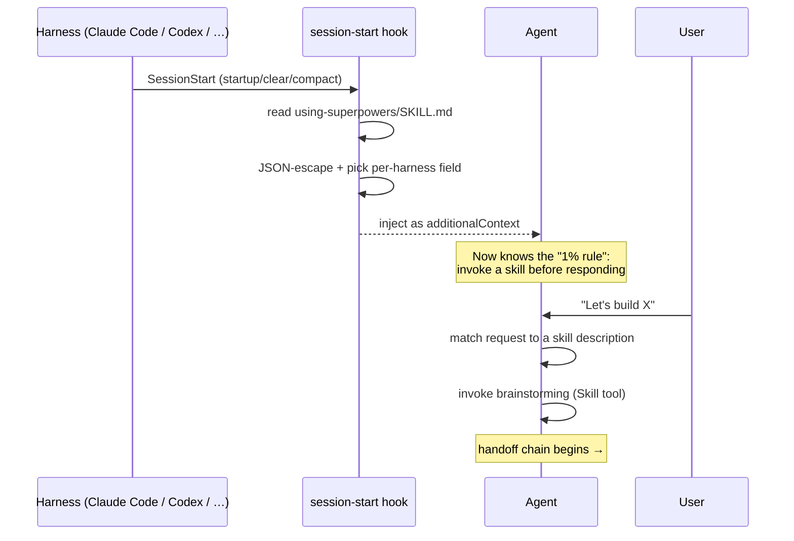
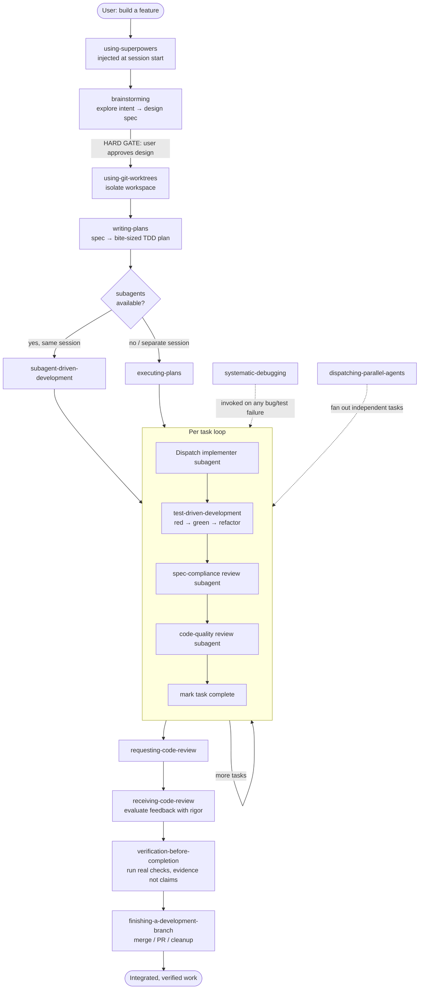
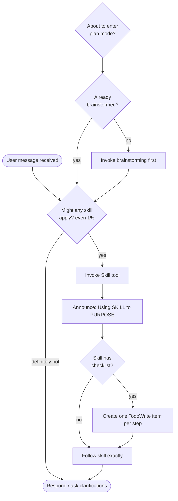

# Superpowers — What It Does & How It Orchestrates Skills

## 1. What this repo is

**Superpowers is a complete software-development methodology for coding agents**, packaged as a
zero-dependency plugin. It is *not* application code — it ships a library of **skills** (markdown
playbooks) plus a single **session-start hook** that bootstraps the agent into using them.

The core idea: when you tell your agent "let's build X", it shouldn't jump straight to writing code.
Instead it should step back, brainstorm a spec, write a plan, execute the plan task-by-task with
fresh subagents and review gates, then verify and integrate. Superpowers encodes that whole loop as
auto-triggering skills so you get the discipline "for free".

It targets many harnesses from one source: Claude Code, Codex CLI/App, Factory Droid, Gemini CLI,
OpenCode, Cursor, GitHub Copilot CLI (see `.claude-plugin/`, `.codex-plugin/`, `.cursor-plugin/`,
`.opencode/`, `gemini-extension.json`).

## 2. The building blocks

| Component | Location | Role |
|-----------|----------|------|
| **Skills** | `skills/*/SKILL.md` | One folder per skill. Frontmatter (`name` + `description`) tells the agent *when* to invoke; body tells it *how* to act. |
| **Session-start hook** | `hooks/session-start` + `hooks/hooks.json` | Injects the `using-superpowers` skill into context at session start so skills auto-trigger. |
| **Cross-platform wrapper** | `hooks/run-hook.cmd` | Polyglot bat/bash script so the hook runs on Windows and Unix. |
| **Support files** | `skills/*/*.md`, `scripts/`, `*-prompt.md` | Subagent prompts, reviewer prompts, examples, helper scripts referenced by skills. |
| **Plugin manifests** | `.*-plugin/`, `gemini-extension.json` | Register the plugin + hook with each harness. |

### The skill catalog

```
using-superpowers ............ Bootstrap: how to find & invoke every other skill
brainstorming ................ Idea → approved design spec (gate before any code)
writing-plans ................ Spec → bite-sized TDD implementation plan
subagent-driven-development .. Execute plan in-session via fresh subagent per task
executing-plans .............. Execute plan in a separate session (no-subagent fallback)
dispatching-parallel-agents .. Fan out 2+ independent tasks concurrently
test-driven-development ...... Red/green TDD discipline for each task
systematic-debugging ......... Root-cause-first bug investigation
requesting-code-review ....... Spawn reviewer subagent to check work
receiving-code-review ........ Evaluate review feedback with rigor, not blind agreement
verification-before-completion Run real verification before claiming "done"
finishing-a-development-branch Decide merge / PR / cleanup at the end
using-git-worktrees .......... Isolated workspace for feature work
writing-skills ............... Meta-skill: author & pressure-test new skills
```

## 3. How orchestration actually works

There is **no central scheduler**. Orchestration is *emergent* from three mechanisms:

1. **Bootstrap injection (the hook).** On `startup | clear | compact`, `hooks.json` runs
   `hooks/session-start`, which reads `skills/using-superpowers/SKILL.md`, JSON-escapes it, and emits
   it as `additionalContext` (with per-harness field names: `additional_context` for Cursor,
   `hookSpecificOutput.additionalContext` for Claude Code, top-level `additionalContext` for Copilot).
   This plants the rule: *"if there's even a 1% chance a skill applies, invoke it before responding."*

2. **Description-as-trigger.** Each skill's frontmatter `description` is a *when-to-use* sentence
   ("Use when encountering any bug…", "before any creative work…"). The agent pattern-matches the
   user's request against these descriptions and invokes the matching skill via the `Skill` tool.

3. **Skill-to-skill handoff.** Skill bodies explicitly name the next skill, forming a chain. E.g.
   brainstorming ends by invoking `writing-plans`; the plan header mandates
   `subagent-driven-development`; that skill calls `test-driven-development` and
   `requesting-code-review` per task; execution ends with `finishing-a-development-branch`.

### Bootstrap sequence



### The end-to-end development loop



### Decision logic baked into `using-superpowers`



## 4. Why it's built this way

- **Skills are code, not prose.** They shape agent behavior, so the repo treats wording (Red Flag
  tables, "your human partner" phrasing, rationalization lists) as carefully tuned and gated behind
  eval evidence (see `CLAUDE.md` and `writing-skills`).
- **Hard gates prevent premature coding.** `brainstorming` refuses to touch code until a design is
  approved — even for "trivial" projects.
- **Fresh subagent per task** keeps each task's context clean and preserves the orchestrator's
  context for coordination; two-stage review (spec → quality) catches drift.
- **Zero dependencies, multi-harness.** One skill library + one hook, re-targeted to every supported
  agent runner. New-harness support is judged by one acceptance test: does "Let's make a react todo
  list" auto-trigger `brainstorming`?

## 5. TL;DR

> A session-start hook injects one bootstrap skill that teaches the agent to auto-invoke skills.
> Each skill's `description` is its trigger; each skill's body hands off to the next. Together they
> form a disciplined loop — **brainstorm → plan → TDD execute with subagent review → verify →
> finish** — with debugging and parallelization woven in on demand. No orchestrator process; the
> orchestration *is* the skills calling each other.
