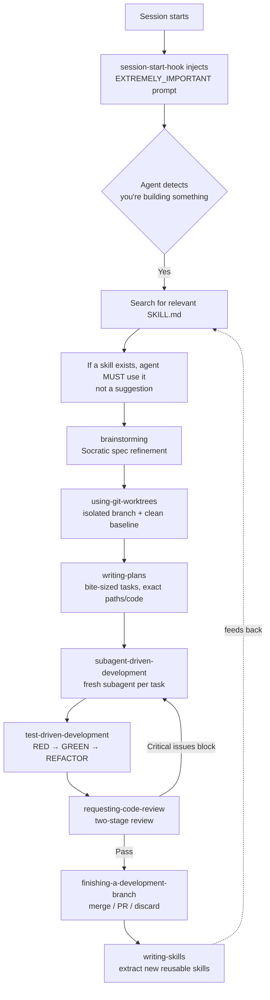

# Why superpowers

## The problem it solves

Coding agents are *capable but undisciplined and amnesiac*. Left alone, they exhibit a predictable set of failure modes:

- They jump straight to writing code without understanding what you actually want.
- They skip tests, or write code first and tests after (or never).
- They debug by guessing rather than tracing root cause.
- They declare "done!" without verifying anything works.
- Most importantly: even when the model *knows* a best practice, it doesn't *reliably apply* it under pressure — and every new session starts from zero, so hard-won lessons evaporate.

The core insight is that the bottleneck is not the model's *knowledge* but its *discipline and procedural memory*. Superpowers is essentially an attempt to externalize an expert engineer's process into something the agent will reliably follow every time.

## How it solves it

The architecture has three layers: a **bootstrap hook**, a **skills library**, and a **self-improvement meta-layer**.

**1. Bootstrap hook.** On session start it injects a prompt wrapped in `<EXTREMELY_IMPORTANT>` tags that teaches the agent three things: *you have skills; search for them with a script; if a skill exists for a task, you must use it.* This is the trigger mechanism — you don't run commands, the skills activate automatically based on what you're doing.

**2. Skills as composable markdown.** Each "skill" is a self-contained `SKILL.md` file — externalized procedural knowledge for one activity (TDD, systematic-debugging, brainstorming, writing-plans, etc.). They chain into a full SDLC: brainstorm → worktree → plan → subagent implementation → review → finish. The **subagent-driven** part matters for your RAG/agent interests: each task gets a *fresh subagent with clean context*, which both keeps the main context window from bloating and gives a two-stage review (spec compliance, then code quality).

**3. Self-improvement meta-layer.** The killer feature is `writing-skills` — a skill for writing skills. You can hand Claude a programming book or a codebase and say "read this, extract the non-obvious reusable lessons as skills." Jesse even fed it 2,249 markdown files of lessons-learned mined from past conversations. New skills get pressure-tested ("TDD for skills") against subagents in realistic high-pressure scenarios to confirm they're actually followed.

## The key design principles and philosophy

The repo states four explicitly:

- **Test-Driven Development, always** — write the failing test first, watch it fail, write minimal code to pass.
- **Systematic over ad-hoc** — process over guessing.
- **Complexity reduction** — simplicity as the primary goal (YAGNI, DRY).
- **Evidence over claims** — verify before declaring success.

But the most intellectually interesting principle is unstated in the README and revealed in the [launch post](https://blog.fsck.com/2025/10/09/superpowers/): **persuasion engineering**. Jesse applied Robert Cialdini's *Influence* principles — authority, commitment, scarcity, social proof — to make the agent reliably comply with its own instructions. Concrete examples:

- *Authority*: the `EXTREMELY_IMPORTANT` framing, and spinning up a "code-reviewer" subagent as an authority figure.
- *Commitment*: forcing the agent to announce out loud that it's using a skill.
- *Scarcity / pressure*: the skill-testing scenarios deliberately simulate "production is down, $5k/minute" pressure to check whether the agent still stops to consult its skills.

There's now [peer-reviewed research from Wharton/Cialdini](https://gail.wharton.upenn.edu/research-and-insights/call-me-a-jerk-persuading-ai/) confirming these persuasion levers measurably work on LLMs — so this isn't folklore. The deeper philosophy is: an LLM is less like a deterministic program you configure and more like a *very capable junior engineer you have to socially manage* — so you manage it with the same psychology that works on humans.

## Why it's so popular

A few factors compounded:

1. **Timing** — it shipped the same morning Anthropic launched the Claude Code plugin system (Oct 2025), riding that wave and landing in the official marketplace.
2. **Real, universal pain** — anyone who's used a coding agent has felt the "it just charged ahead and broke everything" frustration.
3. **It's a methodology, not just a tool** — it captures a senior engineer's full workflow, portable across harnesses (Claude Code, Codex, Gemini CLI, Cursor, Copilot CLI, OpenCode, Factory Droid).
4. **The self-improvement angle** — "skills that write skills" is a genuinely novel, compounding idea that resonated with the agent-building community.

One caveat worth noting: the framework adds real overhead (lots of upfront brainstorming, planning, and review cycles), so it shines on substantial multi-step projects and can feel heavy for quick one-off scripts.