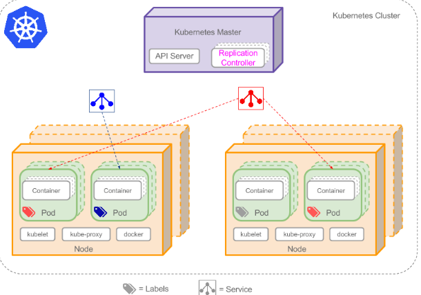
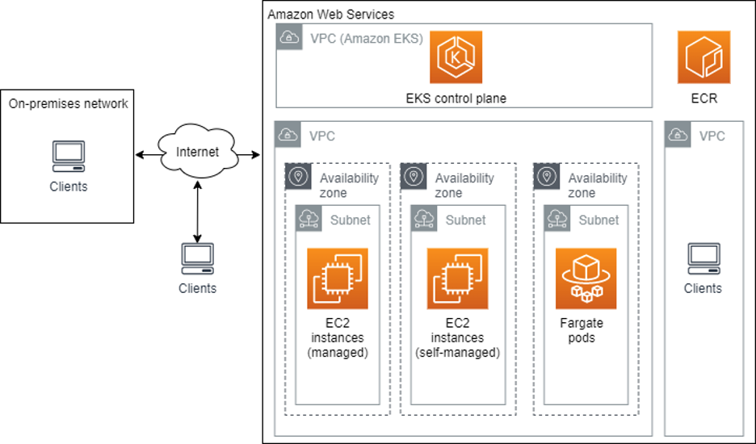

# What is AWS EKS?

Amazon Elastic Kubernetes Service (Amazon EKS) is a managed AWS Kubernetes service that scales, manages, and deploys containerized applications. It typically runs in the Amazon public cloud, but can also be deployed on premises. The Kubernetes management infrastructure of Amazon EKS runs across multiple Availability Zones (AZ). AWS EKS is certified Kubernetes-conformant, which means you can integrate EKS with your existing tools.

## Classic Kubernetes 

## EKS (Kubernetes Cluster on AWS Cloud)

