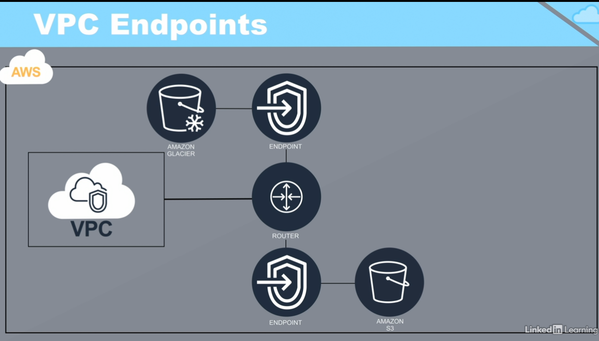
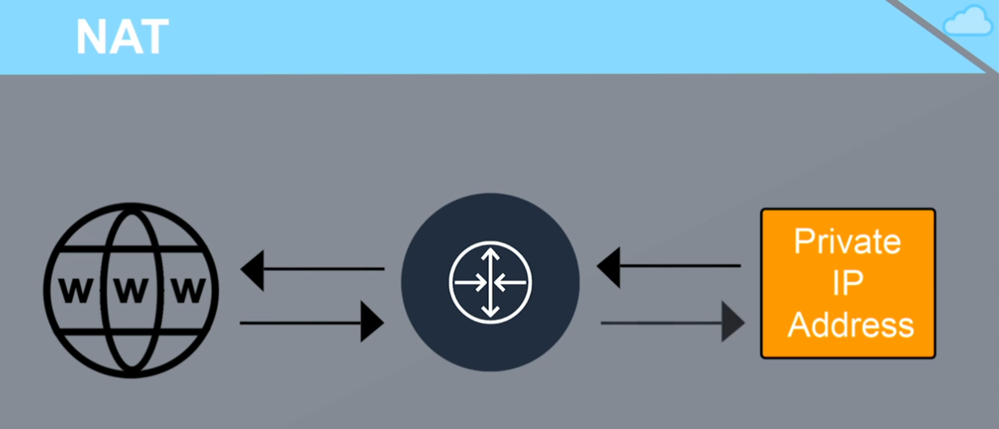

# AWS Network

## VPC
Virtual Private Cloud

Like a data center in the cloud
Connections to the VPC can be secured by VPN protocols
Subnets can be created within VPCs and make public or private
Multiple VPCs can be interconnected with VPC peering

## Subnet
- Public Subnets(DMZ)
- Private Subnets

## VPC Endpoints
Connect your VPC to AWS services: such as AWS S3, AWS Lambda and so on

## Security Group

- Security groups are not for user management in AWS
- Secruity groupus work like a fireware assigned to an EC2 instance,
 Supports only allow rules(deny is implict)
- Traffic flows can be defined for inbound traffice(ingress) and 
outbound traffic(egress)
- Security groups are applied at the instance level but not the subnet level.

## Network Access Control List (NACL)
- Applied to subnets
- Supports both allow & deny rules.
- Frist match applies

## Router Table
A router table defines a set of rules, that are used to determine where 
network traffic is directed.

Router table is associated with VPC and specific Subnets within it.

The first record is to router traffic within VPC
The second is for the internet access.

## Network Address Translation(NAT)
- NAT is used to interconnect private networks and public networks.
- An Elastic IP is associated with the NAT instance for the publich-facing side.
- Instances in the private subnet of the VPC use the NAT to connect to the internet.
- NAT can be implemented using a dedicated NAT instance or using an AWS NAT Gateway

How NAT works?
