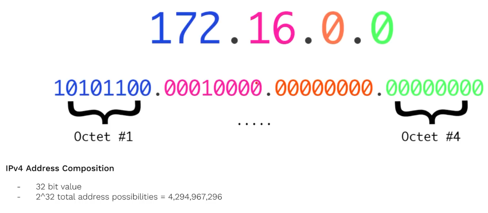
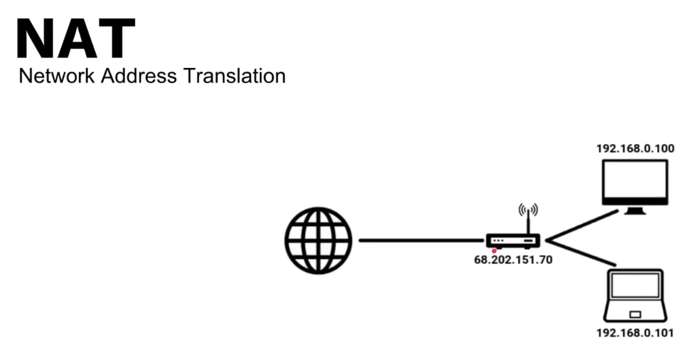
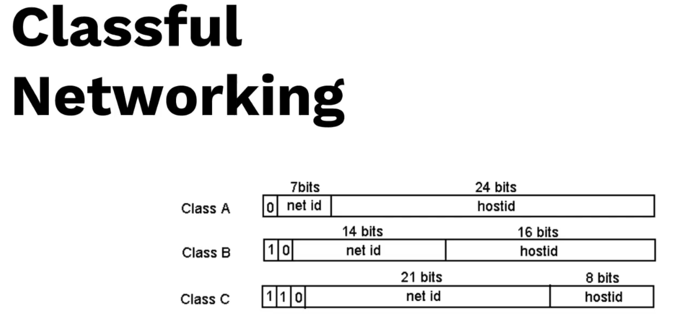
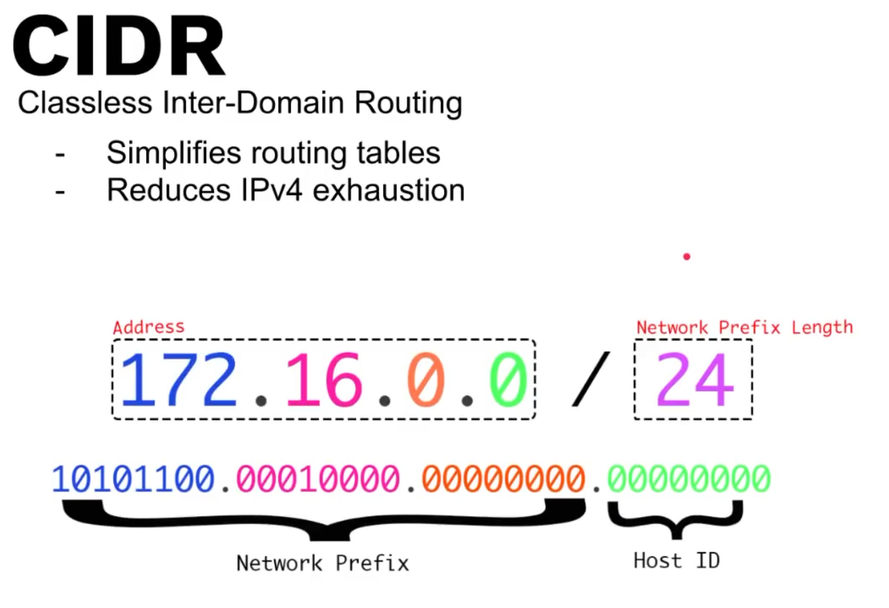

# IPv4 + CIDR + Subnet

## How IPv4 composition

## Network Address Translation(NAT)
> IPv4 is running out, so we use adopt NAT

## How to segment subnet?
 
### Classfull networking(A,B,C)

### Classess-Inter-Domain-Routing
> To resolve the classfull networking may waste ips address issue.

