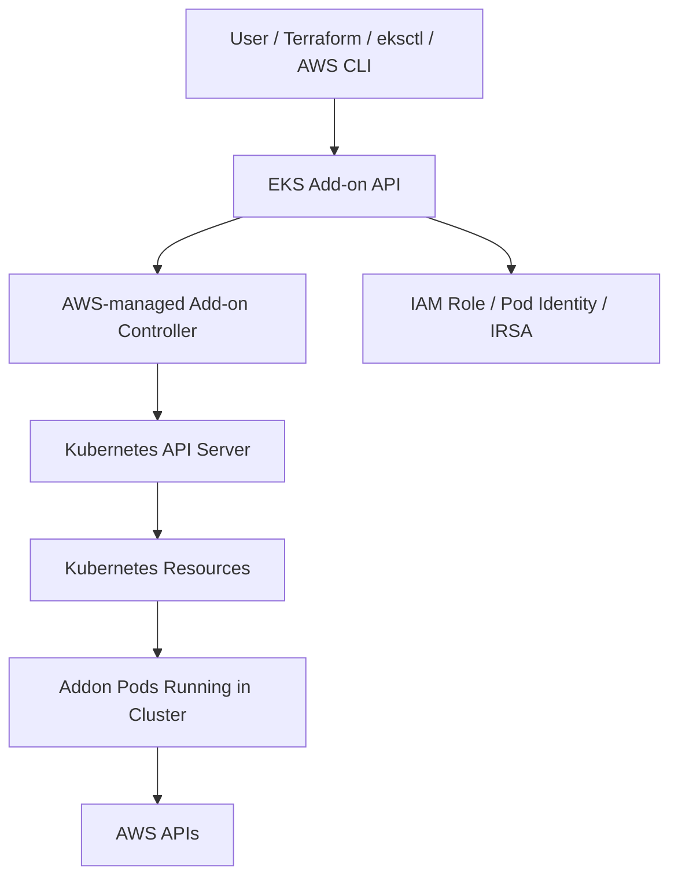
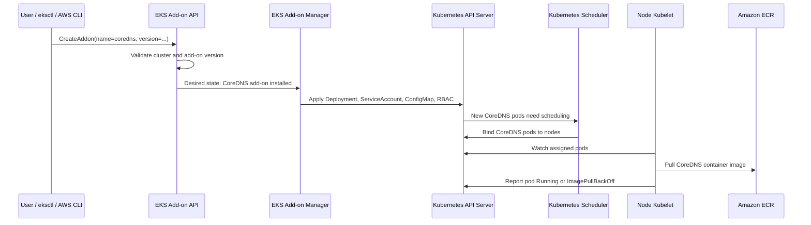
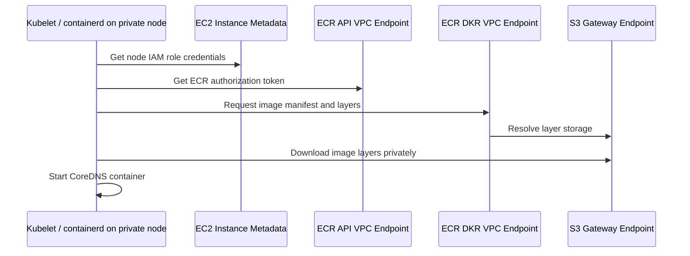
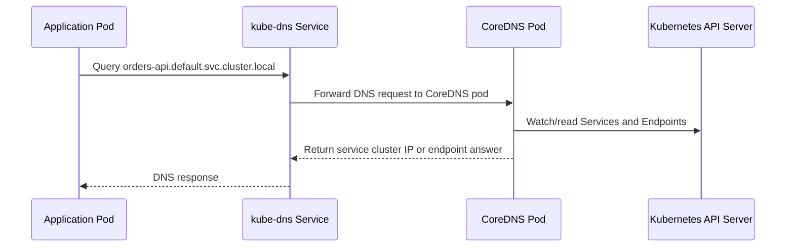
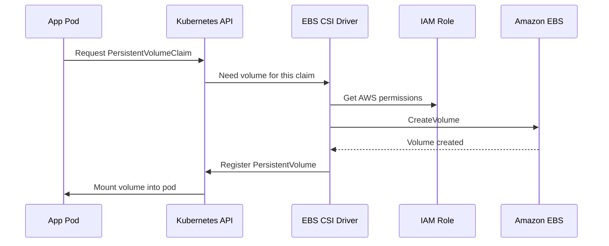

# AWS EKS Add-ons Explained

## What

An **AWS EKS Add-on** is an AWS-managed way to install and maintain common Kubernetes components inside an EKS cluster.

Examples:

- `vpc-cni`
- `coredns`
- `kube-proxy`
- `aws-ebs-csi-driver`
- `aws-efs-csi-driver`
- `aws-load-balancer-controller`
- `amazon-cloudwatch-observability`
- `eks-pod-identity-agent`

These are not just AWS-side settings. Most EKS add-ons create or manage **real Kubernetes resources** inside your cluster, such as:

- `Deployment`
- `DaemonSet`
- `ServiceAccount`
- `ConfigMap`
- `ClusterRole`
- `ClusterRoleBinding`
- Pods running in `kube-system`

## Why EKS Add-ons Exist

Without EKS add-ons, you would install these components yourself using Helm, raw YAML, or third-party tooling.

For example, to use the AWS VPC CNI plugin manually, you would need to:

- choose a compatible version
- apply Kubernetes manifests
- manage upgrades
- patch configuration
- check compatibility with your EKS Kubernetes version
- handle IAM permissions
- recover from bad upgrades

EKS add-ons move part of that lifecycle into AWS.

AWS gives you:

- version compatibility checks
- managed installation
- managed upgrade path
- health status
- integration with IAM roles
- conflict handling for existing Kubernetes objects

## How It Works

At a high level:



When you create an EKS add-on, you call the **EKS API**, not the Kubernetes API directly.

For example:

```bash
aws eks create-addon \
  --cluster-name my-cluster \
  --addon-name aws-ebs-csi-driver \
  --addon-version v1.30.0-eksbuild.1
```

Then AWS does the following:

1. Checks whether the add-on version is compatible with your EKS cluster version.
2. Resolves the managed add-on manifest.
3. Applies Kubernetes resources into the cluster.
4. Watches the health of the add-on.
5. Records the add-on state in the EKS control plane.
6. Allows future upgrades through the EKS API.

## Deep Example: CoreDNS Add-on

CoreDNS is the DNS server used by pods inside Kubernetes.

When a pod calls another service by name, for example:

```text
http://orders-api.default.svc.cluster.local
```

the pod normally sends a DNS query to the Kubernetes DNS service. In EKS, that DNS service is usually backed by the `coredns` deployment in the `kube-system` namespace.

You can install or manage CoreDNS as an EKS add-on:

```bash
aws eks create-addon \
  --cluster-name my-cluster \
  --addon-name coredns
```

If using `eksctl`, the command is usually declared in cluster config or created with:

```bash
eksctl create addon \
  --cluster my-cluster \
  --name coredns
```

Important: `eksctl` does not directly create the Kubernetes deployment itself. `eksctl` is a client-side tool. It calls AWS APIs, and AWS EKS then reconciles the add-on into Kubernetes resources.

### How `eksctl` or AWS CLI Launches the CoreDNS Deployment

The flow is:



The important separation is:

| Step | Who Does It |
|---|---|
| User requests add-on | `aws eks` CLI, `eksctl`, Terraform, or console |
| Add-on desired state stored | EKS control plane |
| Kubernetes objects applied | AWS-managed EKS add-on manager |
| Pods scheduled | Kubernetes scheduler |
| Image pulled | Kubelet and container runtime on worker node |
| Container started | Kubelet on worker node |

So AWS EKS starts the process, but the actual CoreDNS pod is launched by normal Kubernetes machinery.

### What Kubernetes Resources CoreDNS Uses

CoreDNS normally appears as resources like these:

```bash
kubectl get deployment coredns -n kube-system
kubectl get pods -n kube-system -l k8s-app=kube-dns
kubectl get configmap coredns -n kube-system
kubectl get service kube-dns -n kube-system
```

The key resources are:

- `Deployment/coredns`: controls the CoreDNS pods.
- `Pod`: one or more CoreDNS containers running on worker nodes.
- `Service/kube-dns`: stable cluster IP used by pods for DNS queries.
- `ConfigMap/coredns`: CoreDNS configuration, including the Kubernetes DNS plugin.
- `ServiceAccount/coredns`: identity used by CoreDNS against the Kubernetes API.
- `ClusterRole` and `ClusterRoleBinding`: allow CoreDNS to watch Kubernetes services and endpoints.

CoreDNS needs Kubernetes API access because it must answer DNS queries for Kubernetes services and pods. For example, if a service changes, CoreDNS needs to know the new endpoint information.

### How the CoreDNS Image Is Retrieved

The CoreDNS deployment contains a container image reference. In EKS, this is usually an AWS-hosted ECR image, visible with:

```bash
kubectl get deployment coredns -n kube-system \
  -o jsonpath='{.spec.template.spec.containers[0].image}'
```

The image may look similar to this, depending on region and add-on version:

```text
602401143452.dkr.ecr.ap-southeast-2.amazonaws.com/eks/coredns:v1.11.1-eksbuild.6
```

The exact image tag is controlled by the EKS add-on version, not by the application workload.

When the CoreDNS pod is scheduled to a node:

1. The Kubernetes scheduler assigns the CoreDNS pod to a worker node.
2. The kubelet on that node sees the assigned pod.
3. The kubelet asks the container runtime, usually `containerd`, to pull the CoreDNS image.
4. The node uses its IAM role to authenticate to Amazon ECR.
5. The runtime downloads the image manifest and layers.
6. The kubelet starts the CoreDNS container.
7. The pod becomes `Running` if the image pull and container startup succeed.

## Private VPC Image Pull Path

If all worker nodes are in private subnets, they do not have direct internet access. That is fine, but they still need a network path to the image registry.

There are two separate private-network requirements:

| Requirement | Why It Matters |
|---|---|
| Nodes can reach the EKS Kubernetes API endpoint | The kubelet must watch for assigned pods and report pod status |
| Nodes can reach the container registry | The kubelet/container runtime must pull the CoreDNS image |

For the Kubernetes API endpoint, private nodes usually need either:

- EKS private endpoint access enabled for the cluster.
- NAT gateway access if the cluster API endpoint is public-only.

If private nodes cannot reach the Kubernetes API endpoint, the CoreDNS deployment can exist in the control plane, but nodes may not receive or report pod state correctly.

For EKS-managed CoreDNS images hosted in Amazon ECR, private nodes usually need one of these options:

- NAT gateway route to the internet.
- VPC endpoints for private AWS access.

For a fully private pull path through VPC endpoints, the usual minimum is:

| Endpoint | Type | Why It Is Needed |
|---|---|---|
| `com.amazonaws.<region>.ecr.api` | Interface endpoint | Call ECR APIs such as auth and image metadata |
| `com.amazonaws.<region>.ecr.dkr` | Interface endpoint | Talk to the ECR Docker registry |
| `com.amazonaws.<region>.s3` | Gateway endpoint | Download image layers stored through S3-backed paths |

For the ECR interface endpoints, enable private DNS and make sure the endpoint security groups allow HTTPS traffic from the worker node subnets or node security group.

The private pull flow looks like this:



The node's IAM role also needs permission to pull from ECR. The common permissions are included in the AWS managed policy `AmazonEC2ContainerRegistryReadOnly`, including actions like:

- `ecr:GetAuthorizationToken`
- `ecr:BatchCheckLayerAvailability`
- `ecr:GetDownloadUrlForLayer`
- `ecr:BatchGetImage`

### What Happens If Private Networking Is Missing

If the CoreDNS deployment is created successfully but private nodes cannot reach ECR, EKS may show the add-on as degraded and Kubernetes will show pod image pull errors.

Typical symptoms:

```bash
kubectl get pods -n kube-system -l k8s-app=kube-dns
```

You may see:

```text
ImagePullBackOff
ErrImagePull
```

Then inspect the pod:

```bash
kubectl describe pod -n kube-system <coredns-pod-name>
```

Common event messages include:

```text
failed to pull image
i/o timeout
no basic auth credentials
net/http: request canceled while waiting for connection
```

Those errors mean the Kubernetes deployment exists, but the node cannot retrieve the image or authenticate to the registry.

### CoreDNS Runtime Flow After It Starts

Once CoreDNS is running:



CoreDNS is therefore both:

- an EKS-managed add-on from the AWS lifecycle point of view
- a normal Kubernetes deployment from the cluster runtime point of view

## Previous Example: EBS CSI Driver Add-on

Another common EKS add-on is the EBS CSI driver.

You can install it as an EKS add-on:

```bash
aws eks create-addon \
  --cluster-name my-cluster \
  --addon-name aws-ebs-csi-driver \
  --service-account-role-arn arn:aws:iam::123456789012:role/AmazonEKS_EBS_CSI_DriverRole
```

Behind the scenes, EKS creates Kubernetes resources such as:

- `Deployment` for the EBS CSI controller
- `DaemonSet` for node-level CSI components
- `ServiceAccount`
- `ClusterRole`
- `ClusterRoleBinding`
- CSI driver registration objects

The running EBS CSI pods then talk to AWS APIs to create, attach, and mount EBS volumes.

## End-to-End Flow

When your application creates a `PersistentVolumeClaim`:



So the EKS add-on is not the EBS volume itself. It is the managed installation of the component that allows Kubernetes to create and attach EBS volumes.

## What AWS Manages vs What You Manage

AWS manages:

- compatible add-on versions
- installation through the EKS API
- upgrades
- health reporting
- default Kubernetes manifests
- conflict resolution behavior

You still manage:

- whether the add-on is installed
- which version to use
- IAM permissions
- custom configuration
- application resources that depend on the add-on
- debugging workload-level issues

## Important Detail: Add-ons Still Run Inside Your Cluster

This is the key mental model:

> An EKS add-on is AWS-managed lifecycle control for Kubernetes components, but the actual component usually runs as pods inside your EKS cluster.

For example:

| Add-on | What Actually Runs |
|---|---|
| `vpc-cni` | CNI pods as a `DaemonSet` |
| `coredns` | CoreDNS pods as a `Deployment` |
| `kube-proxy` | kube-proxy pods as a `DaemonSet` |
| `aws-ebs-csi-driver` | CSI controller and node pods |
| `amazon-cloudwatch-observability` | agents/collectors inside the cluster |

You can inspect them with:

```bash
kubectl get pods -n kube-system
kubectl get daemonset -n kube-system
kubectl get deployment -n kube-system
```

## Common Misunderstanding

EKS add-ons are not magic AWS services running only outside your cluster.

They are usually **normal Kubernetes components**, but their lifecycle is controlled by AWS EKS.

So if an add-on is unhealthy, you often debug both sides:

```bash
aws eks describe-addon \
  --cluster-name my-cluster \
  --addon-name coredns
```

and:

```bash
kubectl get pods -n kube-system
kubectl describe pod -n kube-system <addon-pod>
kubectl logs -n kube-system <addon-pod>
```

## Mental Model

Think of an EKS add-on like an **AWS-managed Helm chart with version compatibility and health tracking**.

You ask AWS:

> "Install and manage this standard Kubernetes component for my EKS cluster."

AWS then applies and maintains the required Kubernetes resources in your cluster.

## Summary

An AWS EKS Add-on is a managed installation of a Kubernetes infrastructure component. AWS controls the lifecycle through the EKS API, but the actual add-on usually runs as pods, deployments, daemonsets, RBAC rules, and service accounts inside your cluster.
