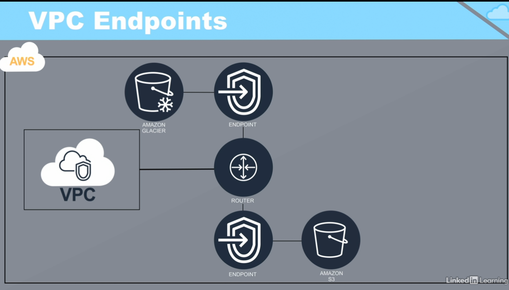
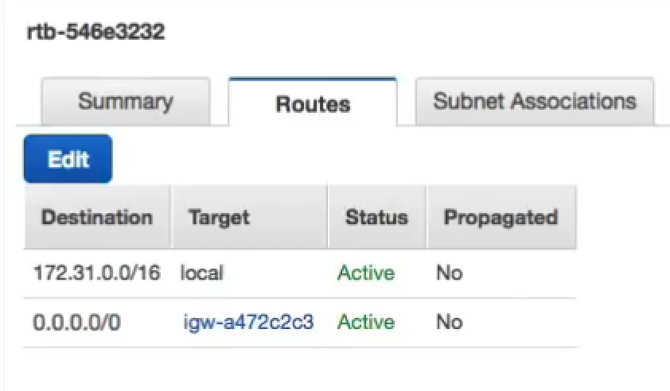
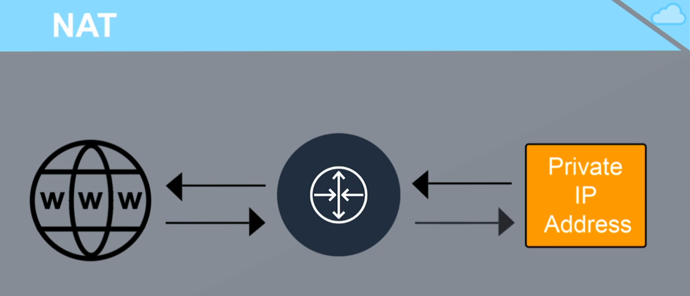
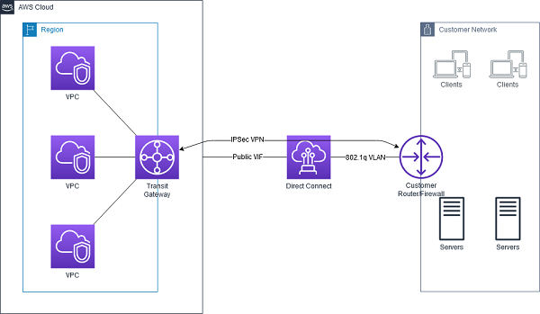
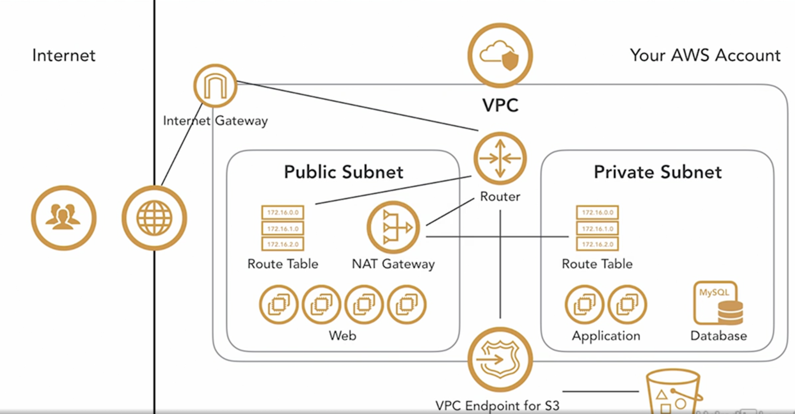

# AWS Network

## VPC
Virtual Private Cloud

Like a data center in the cloud
Connections to the VPC can be secured by VPN protocols
Subnets can be created within VPCs and make public or private
Multiple VPCs can be interconnected with VPC peering

## Subnet
- Public Subnets(DMZ)
- Private Subnets

## VPC Endpoints
Connect your VPC to AWS services: such as AWS S3, AWS Lambda and so on

## Security Group

- Security groups are not for user management in AWS
- Secruity groupus work like a fireware assigned to an EC2 instance,
 Supports only allow rules(deny is implict)
- Traffic flows can be defined for inbound traffice(ingress) and 
outbound traffic(egress)
- Security groups are applied at the instance level but not the subnet level.

## Network Access Control List (NACL)
- Applied to subnets
- Supports both allow & deny rules.
- Frist match applies

## Router Table
A router table defines a set of rules, that are used to determine where 
network traffic is directed.

Router table is associated with VPC and specific Subnets within it.

The first record is to router traffic within VPC
The second is for the internet access.

## Network Address Translation(NAT)
- NAT is used to interconnect private networks and public networks.
- An Elastic IP is associated with the NAT instance for the publich-facing side.
- Instances in the private subnet of the VPC use the NAT to connect to the internet(think yum updates, external database connections, wget calls, OS patch, etc).
- It only works one way. The internet cannot get through your NAT to your private resources unless you explicitly allow it.
- NAT can be implemented using a dedicated NAT instance or using an AWS NAT Gateway.
- You’ll need one in each AZ (for high availability), since they only operate in a single AZ.

How NAT works?

## Internet Gateway
- An Internet Gateway (IGW) is a logical connection between an Amazon VPC and the Internet. It is not a physical device
- If a VPC does not have an Internet Gateway, then the resources in the VPC cannot be accessed from the Internet (unless the traffic flows via a corporate network and VPN/Direct Connect).
- An Internet Gateway allows resources within your VPC to access the internet, and vice versa. In order for this to happen, there needs to be a routing table entry allowing a subnet to access the IGW.
- A subnet is deemed to be a Public Subnet if it has a Route Table that directs traffic to the Internet Gateway.

Where NAT & IGW stand

## VPN connections
To secure the connection between AWS vpc & on-premise.

- AWS supports gateways to connect to the VCP from the local networks.
- Gateways are effetively VPN endpoints
- The Virtual Private Gateway(VPG) is implemented in the Cloud.
- The Customer Gateway (CGW) is implemented in the customer network.

## Transit Gateway
- Contralizes regional network management
- Works with multiple VPCs.
- Can be peered across multiple AWS accounts.
- Works with multiple VPN connections
- Works with multiple AWS Direct Connect gateways.

## A typical AWS VPC network architecture

