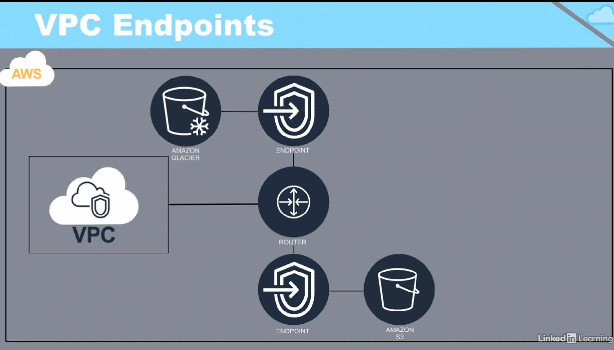
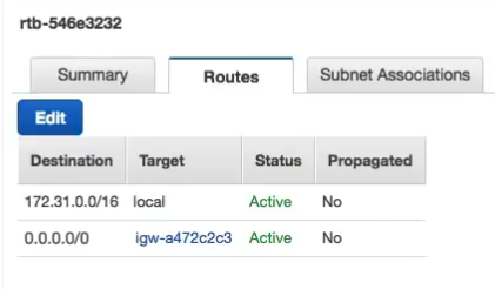
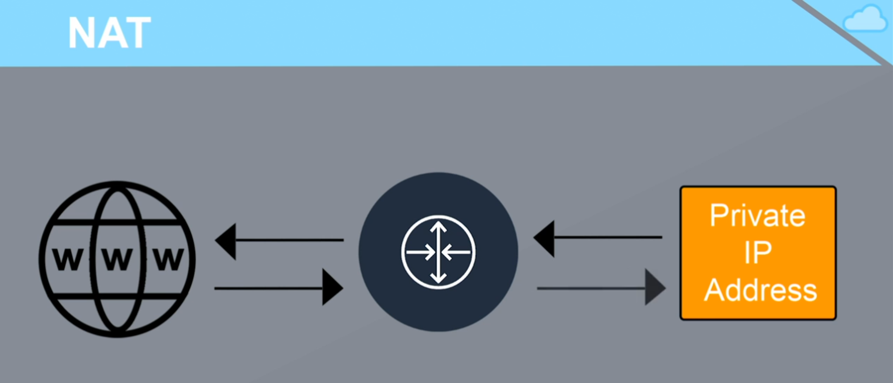
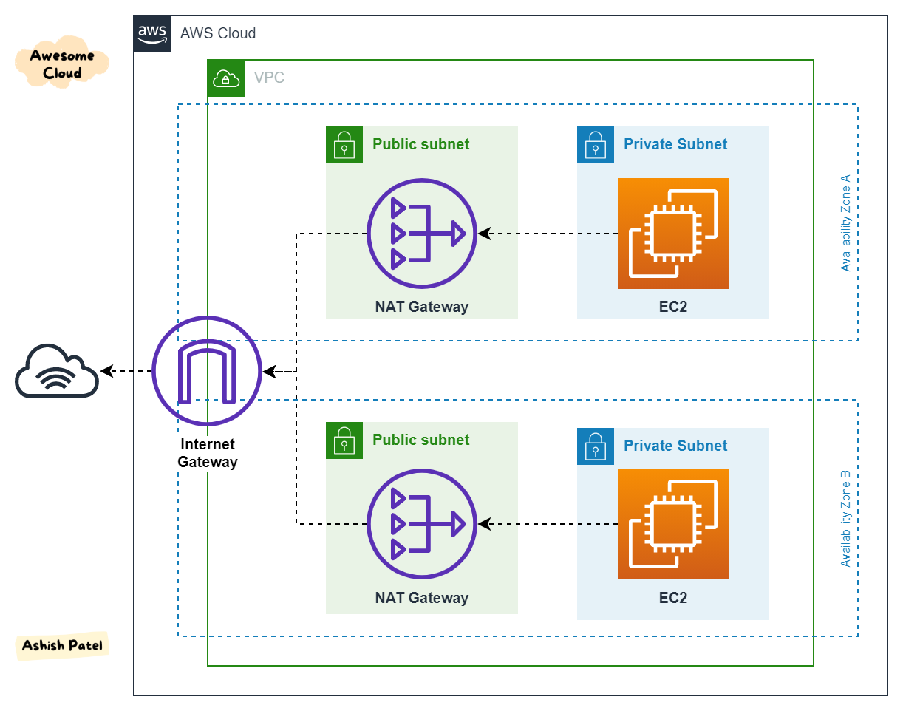
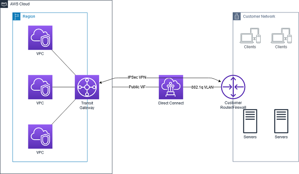
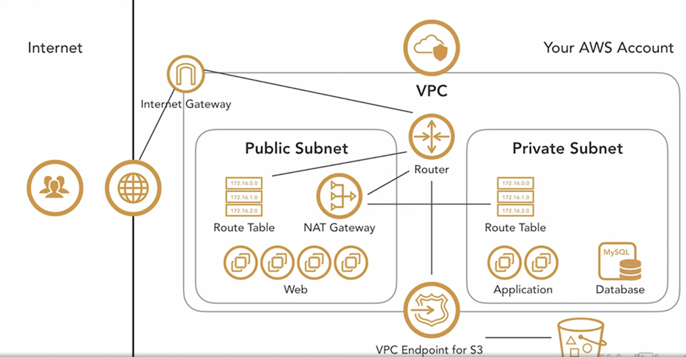

# A Practical Tour of AWS Networking: VPCs, Subnets, Gateways, and More

If you're new to AWS, networking is one of the first — and most confusing — topics you'll run into. There are subnets, gateways, route tables, security groups, NACLs... and it's not always obvious how they fit together. This article walks through the core building blocks of AWS networking, piece by piece, so you can build a clear mental model of how traffic actually flows in and out of your cloud environment.

## The Foundation: VPC (Virtual Private Cloud)

Think of a **VPC** as your own private data center in the cloud. It's an isolated network environment where you control the IP address ranges, subnets, route tables, and gateways.

A few key things to know about VPCs:

- Connections into a VPC can be secured using VPN protocols.
- Within a VPC, you create **subnets**, which can be designated as public or private.
- Multiple VPCs can talk to each other through **VPC peering**.

Everything else in this article — subnets, gateways, NAT, security groups — exists *inside* or *around* a VPC.

## Subnets: Public vs. Private

A VPC is carved up into subnets, and each subnet falls into one of two categories:

- **Public Subnets (DMZ)** — reachable from the internet
- **Private Subnets** — isolated from direct internet access

Whether a subnet is "public" or "private" isn't an inherent property — it's determined by its route table (more on that below). A subnet is public specifically because its route table sends internet-bound traffic to an Internet Gateway.

## VPC Endpoints: Reaching AWS Services Without the Internet

Normally, if a resource inside your VPC wants to talk to a service like S3 or Lambda, that traffic would need to leave your VPC. **VPC Endpoints** let you connect directly to AWS services without routing traffic over the public internet — keeping traffic inside the AWS network and reducing exposure.

## Security Groups: Instance-Level Firewalls

**Security Groups** are one of the most commonly used — and misunderstood — controls in AWS networking. A few important clarifications:

- Security groups are **not** for user or IAM management — that's a separate concern entirely.
- They work like a firewall attached to an EC2 instance.
- They only support **allow** rules — anything not explicitly allowed is implicitly denied.
- Rules can be defined separately for **inbound (ingress)** and **outbound (egress)** traffic.
- Security groups apply at the **instance level**, not the subnet level.

That last point matters: two instances in the same subnet can have completely different security group rules.

## Network ACLs (NACLs): Subnet-Level Firewalls

While security groups protect instances, **Network Access Control Lists (NACLs)** protect subnets. Key differences from security groups:

- Applied at the **subnet** level, not the instance level.
- Support both **allow and deny** rules.
- Rules are evaluated in order — **first match wins**.

Because NACLs operate at a different layer than security groups, they're often used together: NACLs as a coarse-grained subnet perimeter, and security groups as fine-grained, per-instance rules.

## Route Tables: The Traffic Director

A **Route Table** defines the rules AWS uses to decide where network traffic gets sent. Each route table is associated with a VPC and specific subnets within it.

In a typical setup, you'll see at least two entries:

1. A **local route** that routes traffic within the VPC.
2. A route for **internet access**, typically pointing to an Internet Gateway (for public subnets) or a NAT device (for private subnets).

## NAT: Letting Private Resources Reach the Internet

Private subnets, by definition, aren't directly reachable from the internet — but their instances often still need outbound access (think `yum update`, hitting an external database, `wget` calls, OS patching). That's where **Network Address Translation (NAT)** comes in.

- NAT interconnects private and public networks.
- An **Elastic IP** is attached to the NAT device on its public-facing side.
- It's strictly **one-way**: instances in a private subnet can reach the internet through NAT, but the internet cannot initiate connections back into your private resources through it.
- NAT can be implemented as a self-managed **NAT instance** or as a managed **AWS NAT Gateway**.
- NAT gateways operate within a single Availability Zone, so for high availability you'll want one **per AZ**.

Here's how the traffic flow looks in practice:

## Internet Gateway: The Front Door

An **Internet Gateway (IGW)** is the logical connection between a VPC and the public internet. A few things worth remembering:

- It's a logical construct, not a physical appliance.
- Without an IGW, nothing in your VPC is reachable from the internet (unless traffic arrives via a corporate network, VPN, or Direct Connect).
- An IGW enables traffic in *both* directions — but only if a route table entry points the subnet at it.
- This is exactly what makes a subnet "public": a route table entry sending traffic to the IGW.

To see how NAT and IGW relate to each other architecturally:

## VPN Connections: Bridging to On-Premises

When you need a secure connection between your AWS VPC and an on-premises network, AWS provides VPN gateways for exactly that:

- AWS supports gateways that connect a VPC to local, on-premises networks.
- These gateways are, effectively, VPN endpoints.
- The **Virtual Private Gateway (VPG)** lives on the AWS side, in the cloud.
- The **Customer Gateway (CGW)** lives on the customer's side, in their own network.

## Transit Gateway: Simplifying Complex Network Topologies

As your AWS footprint grows — more VPCs, more accounts, more VPN connections — managing point-to-point connections between everything becomes unwieldy. **Transit Gateway** solves this by acting as a central hub:

- Centralizes regional network management.
- Connects to multiple VPCs at once.
- Can be peered across multiple AWS accounts.
- Supports multiple VPN connections simultaneously.
- Supports multiple AWS Direct Connect gateways simultaneously.

## Putting It All Together

Once you understand each piece individually, they combine into a coherent architecture: VPCs contain public and private subnets, route tables direct traffic to IGWs or NAT gateways depending on subnet type, security groups and NACLs layer defense at the instance and subnet level, and Transit Gateway or VPN connections extend the network beyond a single VPC.

Here's what a typical AWS VPC network architecture looks like when all of these components come together:

## Wrapping Up

AWS networking can feel overwhelming at first because so many components interact: VPCs, subnets, route tables, gateways, NAT, security groups, and NACLs. But once you see how each piece routes or filters traffic — and how they layer together — the whole picture becomes much clearer. Start with the VPC as your container, understand how route tables decide where traffic goes, and layer security controls (NACLs at the subnet level, security groups at the instance level) on top. From there, the rest — NAT, IGW, VPN, Transit Gateway — are just different ways of extending that network to the outside world.
