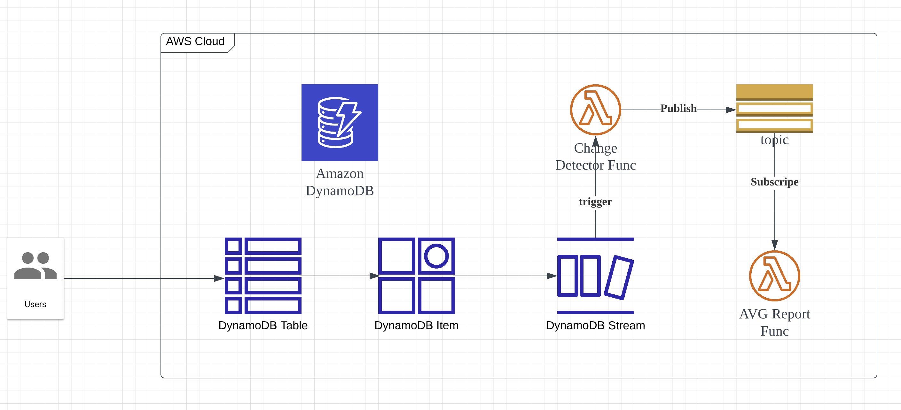
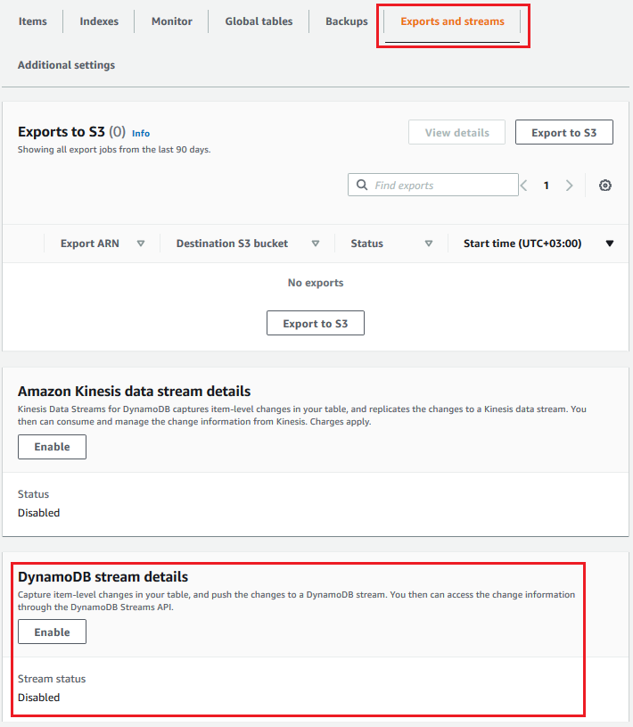
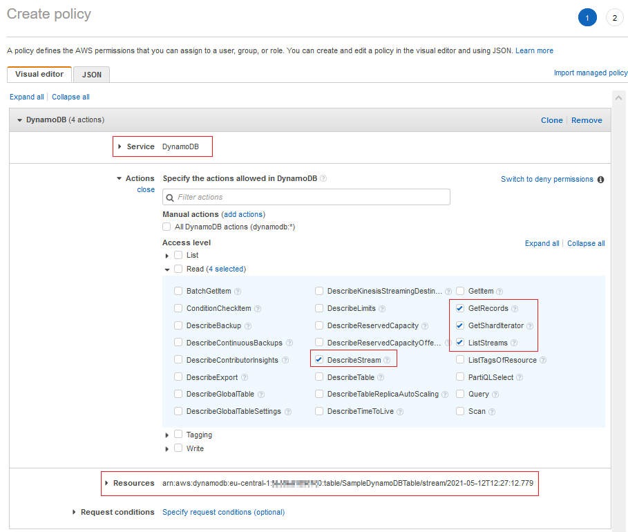

# DynamoDB Stream 

Use case: 

We have a DynamoDB table: `product_price` to store prices of products.
And a lambda function: `avg_price_func` to generate a report of products avg price.

So how can we make the product avg price report reflect the prices in real time.

## Implementation Design

We can do it in such a way.

- Create a SNS Topic: `Report`
- Create lambda function: `AVG Report Func`, and make a subscription to SNS topic: `Report`
- Create a lamdba function: `Change Detector Func`, its main functionality is to publish `event` to SNS Topic: `Report`
- Create DynamoDB table: `product_price`, and make `Change Detector Func` to be DynamoDB stream trigger function.

## Implement with AWS console

### key step 

### make lamdba function `Change Detector Func` as DynamoDB Stream trigger 

### set permission for `Change Detector Func`'s execution role.

## Implemented with Serverless framework

Source code locate at [`src`](./src/index.ts) directory.

We can Serverless framework to allocate & chain all resources together, the yaml definition file is [here](./serverless.yml)

References:
 - https://www.kodyaz.com/aws/dynamodb-streams-send-sns-notification-from-aws-lambda-function-using-python.aspx