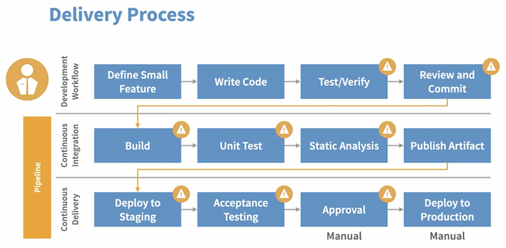
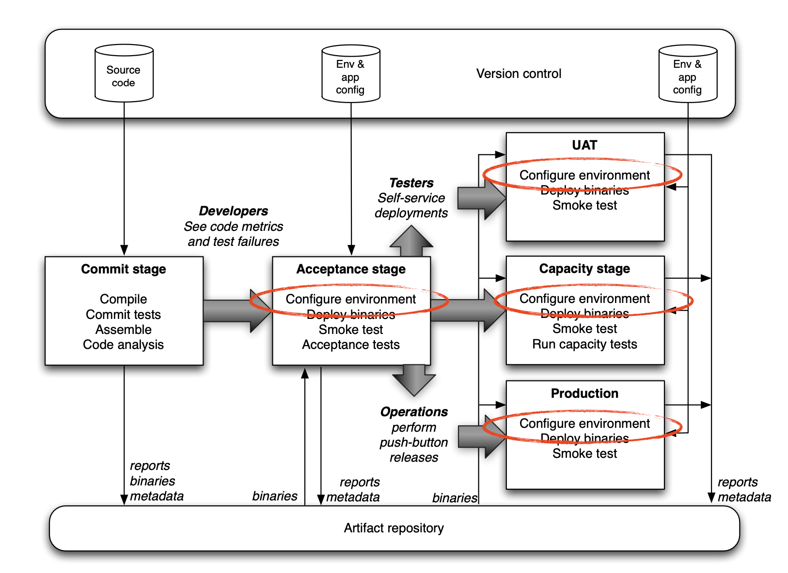
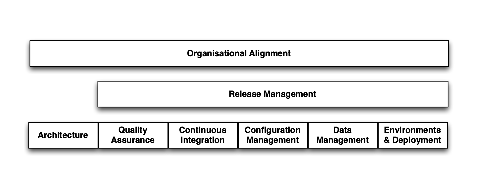

# Continuous Integration & Continuous Delivery

> Delivering value early and often

## Continuous Integration

> Fast, automated feedback on the correctness of your application every time there is a change to code

- Integrate changes within same component developed by multiple developers.
- Integrate changes across different components developed parallelly. 

## Continuous Delivery

> Fast, automated feedback on the production readiness of your application every time there is a change — to production readiness 
code, infrastructure, or configuration.

## Pipelines 

> A series of orchestrated steps that takes source code from version control all the way into production.

## Delivery Process

## Overal CI & CD Process

## What CICD involves

