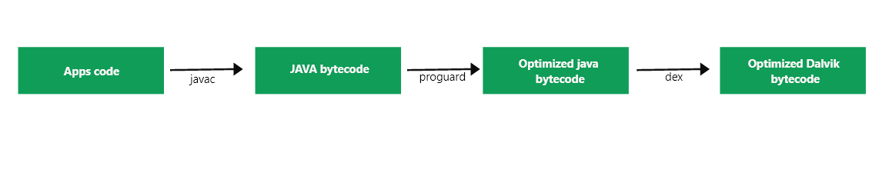
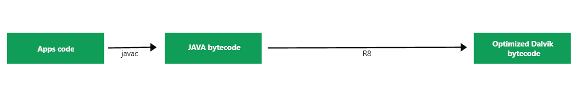

# Difference Between Proguard and R8 in Android

>Proguard and R8 both are similar tools that are used for reducing the size of our APK and increase the performance of our APK by shrinking the unused resources. In this article, we will take a look at: 

- What is Proguard?
- What is R8?
- Difference between Proguard and R8.

## What is Proguard? 
>Proguard is a java tool in Android that helps to do the following things such as: 

- It removes the unused classes and methods from your app which helps to reduce the size of your APK.
- It makes your application difficult to reverse engineer by obfuscating the code.
- It reduces the size of your application.

## What is R8? 
>R8 is another tool that will convert your java byte code into an optimized format of dex code. It will check the whole application and will remove the unused classes and methods. It helps us to reduce the size of our APK and to make our app more secure. R8 uses similar proguard rules to modify its default behavior. 

Proguard

R8

## Difference Table 
Proguard

R8

Proguard is having lesser speed in comparison with R8 which affects the build time.	R8 is having a faster processing time which helps developers in reducing build time.
The output quality by using proguard is not superior. 	The output quality using R8 is superior.
Proguard reduces app size by 8.5 %.	R8 reduces app size by 10 %.
The conversion process of converting apps code to Optimized Dalvik bytecode is as follows : 

Apps Code > Java bytecode > Optimized java bytecode > Optimized Dalvik bytecode.

The conversion process of converting apps code to Optimized Dalvik bytecode is as follows : 

Apps code > Java bytecode > Optimized Dalvik bytecode.

Proguard is only supported for the gradle plugin which is below 3.4.0	R8 is only supported for the gradle plugin of 3.4.0 and above.
Peephole Optimizations in Proguard is around 520.	Peephole Optimizations in R8 is around 6.
No of the steps in converting of Apps code to Optimized Dalvik code is 4.	No of the steps in converting Apps code to Optimized Dalvik bytecode is 3. 
Proguard is not having Kotlin specific optimizations. 	R8 is having Kotlin specific optimizations. 
Proguard does not propagate constant arguments. 	R8 propagate constant arguments. 

[Origin from](https://www.geeksforgeeks.org/difference-between-proguard-and-r8-in-android/)

>References:

https://www.guardsquare.com/blog/proguard-and-r8

https://stackoverflow.com/questions/52818404/android-java-transition-migration-from-proguard-to-r8

https://www.guardsquare.com/blog/comparison-proguard-vs-r8-october-2019-edition