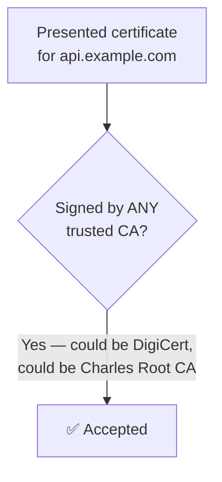
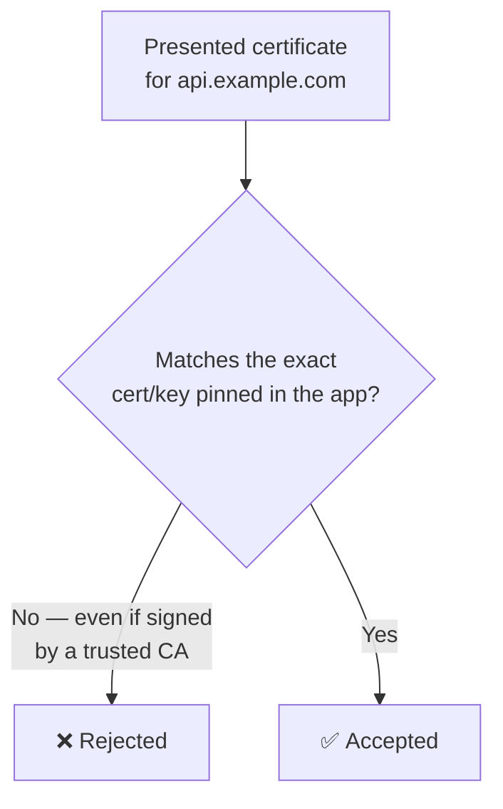
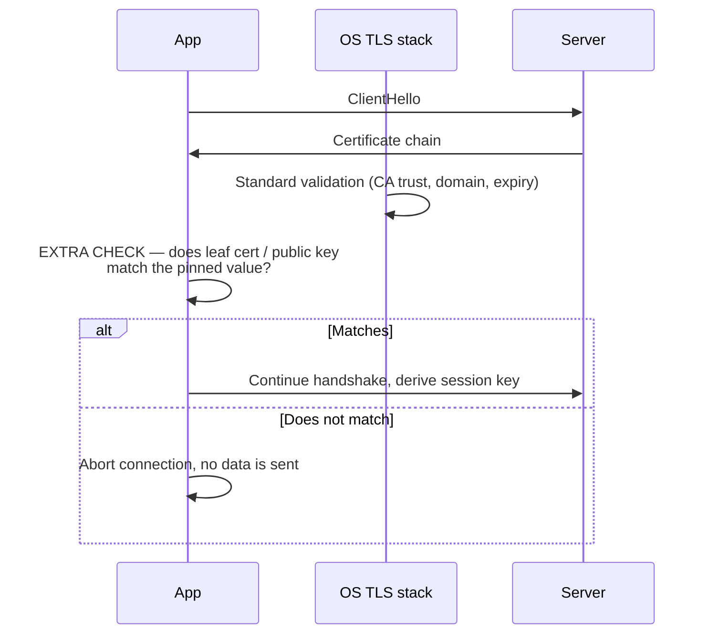
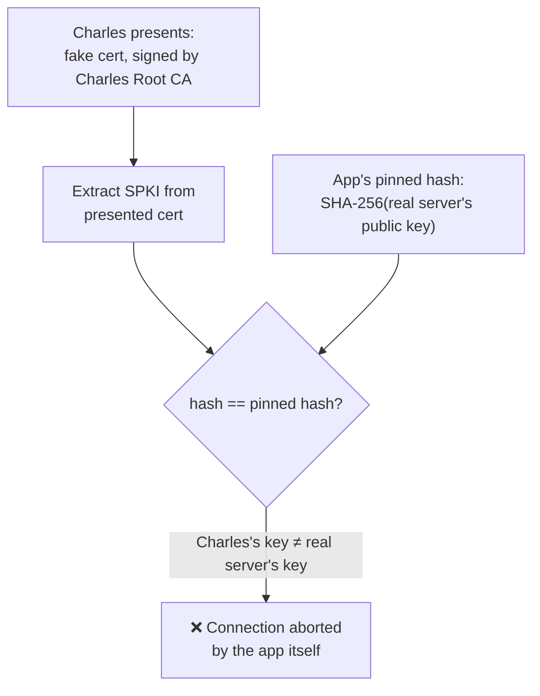
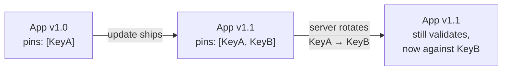

# Mobile App Certificate Pinning: Underlying Principle and a Swift Example

[Charles-network-sniff.md](./Charles-network-sniff.md) explained how Charles Proxy performs HTTPS MITM inspection by getting the client to trust a fake Root CA. Section 11 of that document mentioned that **SSL/Certificate Pinning** defeats this attack.

This document goes one level deeper: **why does pinning work, exactly, and how do you implement it in an iOS app with Swift?**

---

## Table of Contents

1. [The Trust Gap That Pinning Closes](#1-the-trust-gap-that-pinning-closes)
2. [What "Pinning" Actually Means](#2-what-pinning-actually-means)
3. [Two Pinning Strategies: Certificate vs Public Key](#3-two-pinning-strategies-certificate-vs-public-key)
4. [Where Pinning Hooks Into the TLS Handshake](#4-where-pinning-hooks-into-the-tls-handshake)
5. [Why This Blocks Charles/MITM Proxies](#5-why-this-blocks-charlesmitm-proxies)
6. [Swift Example: Public Key Pinning with URLSession](#6-swift-example-public-key-pinning-with-urlsession)
7. [Swift Example: Certificate Pinning](#7-swift-example-certificate-pinning)
8. [Handling Certificate Rotation](#8-handling-certificate-rotation)
9. [Limitations and Trade-offs](#9-limitations-and-trade-offs)
10. [Summary](#10-summary)

---

## 1. The Trust Gap That Pinning Closes

Normal HTTPS validation asks one question:

> Was this certificate signed by **any** CA that the OS trusts?

The OS trust store contains hundreds of CAs. If **any one** of them — or anything the user has installed, like a Charles Root CA, a corporate MDM certificate, or malware — is willing to vouch for a certificate, the connection is accepted:



This is the exact gap Charles walks through: it doesn't need to compromise DigiCert, it just needs **one** entry in the trust store — the one the user installed themselves.

Pinning closes that gap by refusing to ask "any trusted CA?" and instead asking a much narrower question:

> Does this certificate match **the one specific certificate (or key) I already know belongs to my server**?



The OS trust store becomes irrelevant. The app carries its own, much smaller "trust store" of one.

---

## 2. What "Pinning" Actually Means

"Pinning" is just baking an expected value into the app binary at build time, and comparing the server's presented certificate against it at connection time:

| What gets pinned | Stored as |
|---|---|
| The full leaf certificate | A `.cer` / `.der` file bundled in the app |
| Just the public key | A SHA-256 hash of the SubjectPublicKeyInfo (SPKI) |
| An intermediate/root CA | A `.cer` file, when pinning to your own private CA |

Because the value lives inside the compiled app rather than in a system-level trust store, an attacker (or a debugging proxy like Charles) cannot simply add a new trusted CA to the device and expect the app to accept it — the app never consults the device's trust store for this decision.

---

## 3. Two Pinning Strategies: Certificate vs Public Key

| | Pin the certificate | Pin the public key |
|---|---|---|
| **What's compared** | Byte-for-byte DER of the cert | SHA-256 hash of the SPKI (public key) |
| **Breaks on cert renewal?** | Yes — a renewed cert is a new file, even with the same key | No — as long as the key pair is reused |
| **Breaks on key rotation?** | Yes | Yes |
| **Common in practice** | Simpler to reason about, but operationally fragile | Preferred — survives routine cert renewal (e.g. yearly Let's Encrypt reissue) as long as the private key doesn't change |

Most production implementations (and Apple's own `NSPinnedDomains` App Transport Security feature) pin the **public key hash**, not the full certificate, for exactly this reason.

---

## 4. Where Pinning Hooks Into the TLS Handshake

Recall from the Charles doc: during the TLS handshake, the server presents its certificate chain **before** any symmetric session key is derived. Pinning adds one extra check at that exact moment — after the OS's own chain-of-trust validation, but before the app treats the connection as usable:



In iOS, this hook point is the `URLSession` delegate method `urlSession(_:didReceive:completionHandler:)`, which fires on every TLS challenge and gives you the raw `SecTrust` object containing the server's certificate chain — before any request data is sent.

---

## 5. Why This Blocks Charles/MITM Proxies

Walk through the Charles MITM flow from the referenced doc, now with pinning active:

1. Client sends `CONNECT api.example.com:443` to Charles.
2. Charles mints a certificate: `Subject: api.example.com`, `Issuer: Charles Root CA`.
3. **Normal HTTPS:** OS checks "is Charles Root CA trusted?" → yes (user installed it) → accepted.
4. **With pinning:** the app doesn't ask the OS that question at all for the purposes of pinning. It extracts the public key from whatever certificate was presented and compares its hash to the hardcoded value.



Charles's fake certificate carries **Charles's own key pair**, not the real server's. No amount of OS-level trust can make Charles's public key hash equal to the pinned value, because Charles doesn't possess — and cannot possess — the real server's private key. This is the same reason patching the OS trust store, using a "more convincing" fake CA, or getting a real CA to mis-issue a certificate all fail: **pinning doesn't ask who signed the cert, it asks whether the key is the one specific key the app already knows about.**

---

## 6. Swift Example: Public Key Pinning with URLSession

This is the recommended approach — pin the SHA-256 hash of the server's public key (SPKI).

```swift
import Foundation
import CommonCrypto

final class PinningURLSessionDelegate: NSObject, URLSessionDelegate {

    /// SHA-256 hashes of the expected SubjectPublicKeyInfo, base64-encoded.
    /// Generate with:
    ///   openssl s_client -connect api.example.com:443 </dev/null 2>/dev/null \
    ///     | openssl x509 -pubkey -noout \
    ///     | openssl pkey -pubin -outform der \
    ///     | openssl dgst -sha256 -binary | base64
    private let pinnedPublicKeyHashes: Set<String> = [
        "wF7g6t3+PsMWQ4nDXTOFGO5t/7BsdEEnkZWt3AmzZ8I=",   // current key
        "9SLklkLE1lm/lB9EhaGgUwFvJXfXV3+Sg5NGSCLLpQg="    // next key, pre-provisioned for rotation
    ]

    func urlSession(
        _ session: URLSession,
        didReceive challenge: URLAuthenticationChallenge,
        completionHandler: @escaping (URLSession.AuthChallengeDisposition, URLCredential?) -> Void
    ) {
        guard challenge.protectionSpace.authenticationMethod == NSURLAuthenticationMethodServerTrust,
              let serverTrust = challenge.protectionSpace.serverTrust else {
            completionHandler(.performDefaultHandling, nil)
            return
        }

        // 1. Let the OS do the normal chain-of-trust / expiry / hostname checks first.
        var error: CFError?
        guard SecTrustEvaluateWithError(serverTrust, &error) else {
            completionHandler(.cancelAuthenticationChallenge, nil)
            return
        }

        // 2. Extract the leaf certificate's public key and hash it.
        guard let serverCertificate = (SecTrustCopyCertificateChain(serverTrust) as? [SecCertificate])?.first,
              let serverPublicKey = SecCertificateCopyKey(serverCertificate),
              let serverPublicKeyData = SecKeyCopyExternalRepresentation(serverPublicKey, nil) as Data? else {
            completionHandler(.cancelAuthenticationChallenge, nil)
            return
        }

        let hash = sha256Base64(spkiDER(from: serverPublicKeyData))

        // 3. Compare against the pinned set. Anything else — including a
        //    perfectly valid, OS-trusted certificate — is rejected.
        if pinnedPublicKeyHashes.contains(hash) {
            completionHandler(.useCredential, URLCredential(trust: serverTrust))
        } else {
            completionHandler(.cancelAuthenticationChallenge, nil)
        }
    }

    private func sha256Base64(_ data: Data) -> String {
        var digest = [UInt8](repeating: 0, count: Int(CC_SHA256_DIGEST_LENGTH))
        data.withUnsafeBytes { buffer in
            _ = CC_SHA256(buffer.baseAddress, CC_LONG(data.count), &digest)
        }
        return Data(digest).base64EncodedString()
    }

    /// SecKeyCopyExternalRepresentation returns the raw key, not full SPKI DER,
    /// so prepend the algorithm-specific ASN.1 header before hashing.
    private func spkiDER(from rawKey: Data) -> Data {
        let rsa2048Header: [UInt8] = [
            0x30, 0x82, 0x01, 0x22, 0x30, 0x0d, 0x06, 0x09, 0x2a, 0x86, 0x48, 0x86,
            0xf7, 0x0d, 0x01, 0x01, 0x01, 0x05, 0x00, 0x03, 0x82, 0x01, 0x0f, 0x00
        ]
        return Data(rsa2048Header) + rawKey
    }
}

// Usage:
let session = URLSession(
    configuration: .default,
    delegate: PinningURLSessionDelegate(),
    delegateQueue: nil
)
session.dataTask(with: URL(string: "https://api.example.com/user")!) { data, response, error in
    // handle response
}.resume()
```

Key points:

- `SecTrustEvaluateWithError` still runs the standard OS validation first — pinning is an **additional** layer, not a replacement for it.
- The comparison uses the **public key hash**, computed from data delegates already receive during the handshake, before any request body is sent.
- Two hashes are pinned at once — the currently deployed key and the next one — to support rotation without an app update (see [Section 8](#8-handling-certificate-rotation)).

---

## 7. Swift Example: Certificate Pinning

For completeness, here is the simpler but more brittle alternative — pinning the exact certificate bytes.

```swift
final class CertPinningDelegate: NSObject, URLSessionDelegate {

    private lazy var pinnedCertificateData: Data = {
        let path = Bundle.main.path(forResource: "api-example-com", ofType: "cer")!
        return try! Data(contentsOf: URL(fileURLWithPath: path))
    }()

    func urlSession(
        _ session: URLSession,
        didReceive challenge: URLAuthenticationChallenge,
        completionHandler: @escaping (URLSession.AuthChallengeDisposition, URLCredential?) -> Void
    ) {
        guard challenge.protectionSpace.authenticationMethod == NSURLAuthenticationMethodServerTrust,
              let serverTrust = challenge.protectionSpace.serverTrust,
              let serverCertificate = (SecTrustCopyCertificateChain(serverTrust) as? [SecCertificate])?.first else {
            completionHandler(.cancelAuthenticationChallenge, nil)
            return
        }

        let serverCertData = SecCertificateCopyData(serverCertificate) as Data

        if serverCertData == pinnedCertificateData {
            completionHandler(.useCredential, URLCredential(trust: serverTrust))
        } else {
            completionHandler(.cancelAuthenticationChallenge, nil)
        }
    }
}
```

`api-example-com.cer` is exported once (`openssl s_client ... | openssl x509 -outform der -out api-example-com.cer`) and bundled as an app resource. Every certificate renewal — even with an identical key pair — invalidates this pin and requires a new app release, which is why public-key pinning is generally preferred.

---

## 8. Handling Certificate Rotation

Because the pin lives inside a compiled, App-Store-reviewed binary, rotating the server's certificate/key with no coordination will hard-break every installed copy of the app that has the old pin baked in. Two common mitigations:

1. **Pin the public key, and pre-provision the next key** before rotating, as shown in Section 6's `pinnedPublicKeyHashes` set. Since the same key pair can be reused across a certificate renewal, this alone avoids most routine renewal breakage.
2. **Backup pins**: when actually rotating to a *new* key pair, generate the new certificate ahead of time, ship an app update containing both the old and new key hashes, wait for adoption to reach acceptable levels, then rotate the server — old app versions still validate against the pin they shipped with until they're updated.



---

## 9. Limitations and Trade-offs

| Limitation | Detail |
|---|---|
| **Not a silver bullet** | On a jailbroken/rooted device, or in a debug build, tools like Frida/Objection can hook `SecTrustEvaluateWithError` or the delegate method directly and force it to always succeed — this is exactly the workaround mentioned in the Charles doc's Section 11. Pinning raises the cost of interception; it does not make it impossible on a device the attacker fully controls. |
| **Operational risk** | Get certificate rotation wrong, and you lock out every user on an old app version until they update — a self-inflicted outage. |
| **No pinning on debug builds is common** | Many teams `#if DEBUG` out the pinning check so QA can still use Charles/Proxyman during development, and only ship it enabled in Release builds. |
| **CA-level pinning is looser** | Pinning to your organization's root/intermediate CA (rather than the leaf) is less brittle across renewals, but also permits any certificate that CA later issues — a smaller trust surface than "any public CA," but larger than "this one key." |

---

## 10. Summary

Certificate pinning does not add encryption strength — TLS is already unbreakable by brute force. What it changes is **the trust decision**:

> Normal HTTPS asks "did *any* CA the OS trusts vouch for this?" Pinning asks "is this the *one specific* certificate/key I already know belongs to my server?" — and answers that question using a value baked into the app itself, bypassing the OS trust store entirely.

That is precisely the mechanism that makes a Charles-style MITM proxy — which can only ever present its **own** key, regardless of which CA signs for it — fail the check, even after its Root CA has been fully installed and trusted on the device.

| Scenario | Validation performed |
|---|---|
| **Normal HTTPS** | "Signed by a trusted CA?" — Charles passes once its root cert is trusted |
| **Certificate pinning** | "Byte-identical to the pinned cert?" — breaks on every cert renewal |
| **Public key pinning** | "SHA-256(public key) in the pinned set?" — survives renewal, breaks on key rotation unless pre-provisioned |
| **On a controlled device** | Runtime hooking (Frida/Objection) can still bypass the check in the app's own code |
