# How Charles Proxy Works: From HTTP Proxy to HTTPS MITM Traffic Inspection

Charles Proxy is one of the most widely used HTTP/HTTPS debugging tools for web and mobile developers. It lets you inspect API calls, debug network issues, modify requests and responses, simulate slow networks, and analyze application behavior.

The most common question about Charles is:

> HTTPS traffic is encrypted. How can Charles still see the actual request and response data?

**The short answer:** Charles is a local proxy server that uses Man-In-The-Middle (MITM) technology. It creates two independent TLS connections — one to the client and one to the server — so it can decrypt, inspect, modify, and re-encrypt HTTPS traffic in the middle.

This document explains how that works, from the basics of HTTP proxying up through the full HTTPS MITM flow, and why some apps still can't be captured.

---

## Table of Contents

1. [What Is Charles?](#1-what-is-charles-a-local-httphttps-proxy-server)
2. [HTTP Proxying: Why HTTP Is Easy to Capture](#2-http-proxying-why-http-traffic-is-easy-to-capture)
3. [Why HTTPS Cannot Normally Be Captured](#3-why-https-cannot-normally-be-captured)
4. [Understanding the TLS Handshake](#4-understanding-the-tls-handshake)
5. [How Charles Decrypts HTTPS Traffic](#5-how-charles-decrypts-https-traffic)
6. [The HTTPS MITM Process, Step by Step](#6-the-https-mitm-process-step-by-step)
7. [The Complete Data Flow](#7-the-complete-data-flow)
8. [Why You Must Install the Charles Root Certificate](#8-why-you-must-install-the-charles-root-certificate)
9. [Charles Core Features](#9-charles-core-features)
10. [HTTPS Capture Configuration](#10-https-capture-configuration)
11. [SSL Pinning: Why Some Apps Can't Be Captured](#11-ssl-pinning-why-some-apps-cant-be-captured)
12. [Troubleshooting](#12-troubleshooting)
13. [Summary](#13-summary)

---

## 1. What Is Charles? A Local HTTP/HTTPS Proxy Server

At its core, Charles is a **local proxy server**. By default it listens on:

```
127.0.0.1:8888
```

Instead of talking directly to the destination server, the client routes its traffic through Charles:

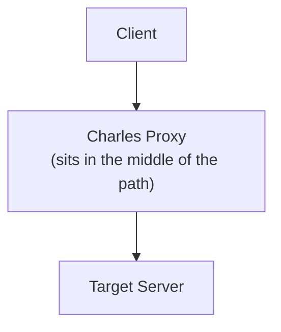

Because Charles sits in the middle of the communication path, it can:

- Capture HTTP/HTTPS requests
- Inspect request headers and bodies
- View cookies and authentication tokens
- Modify requests before they reach the server
- Modify responses before they reach the client
- Replay requests
- Simulate slow or unreliable networks
- Redirect traffic between environments

---

## 2. HTTP Proxying: Why HTTP Traffic Is Easy to Capture

HTTP is a **plain-text** protocol. For example, a client sends:

```http
GET /api/user?id=100 HTTP/1.1
Host: example.com
Cookie: token=abc123
```

Once the client is configured to use Charles as its HTTP proxy (`127.0.0.1:8888`), the request flows through it:

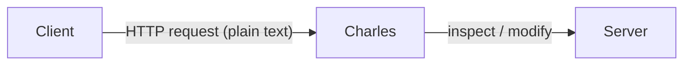

The response follows the reverse path:

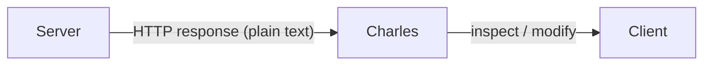

Because HTTP has no encryption, Charles reads and modifies everything directly. No certificates, no keys, no special setup — proxying alone is enough.

---

## 3. Why HTTPS Cannot Normally Be Captured

HTTPS is simply:

```
HTTPS = HTTP + TLS
```

TLS adds three guarantees:

| Property | What it protects against |
|---|---|
| **Encryption** | Reading the data in transit |
| **Authentication** | Talking to an impostor server |
| **Integrity** | Silent tampering with the data |

A normal HTTPS connection is opaque to anyone in the middle — a third party on the path sees only ciphertext:

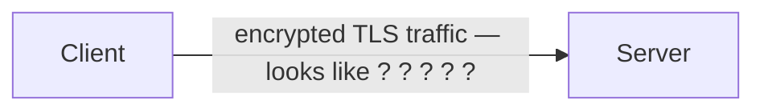

Without the session keys, that data cannot be decrypted. This is exactly the protection Charles has to work *around* — not by breaking it, but by becoming a party the client trusts.

---

## 4. Understanding the TLS Handshake

A common misconception:

> HTTPS uses the server's public key to encrypt all communication.

That is **not** how it works. HTTPS uses asymmetric (public/private key) cryptography **only during the handshake**. The actual application data is protected by **symmetric** encryption, which is far faster.

### 4.1 Handshake Phase

The server presents its certificate:

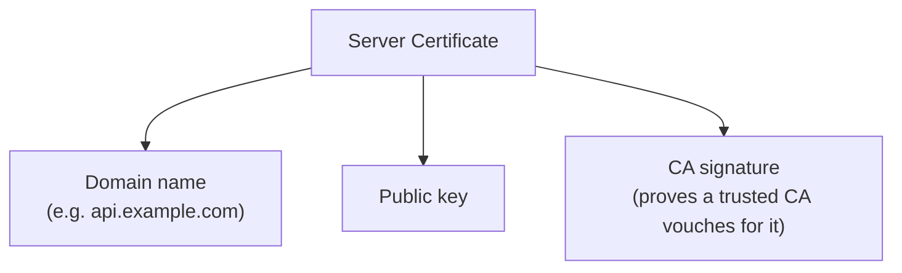

The client validates it:

- Is the certificate issued by a **trusted CA**?
- Does the **domain** match the site being visited?
- Is the certificate **within its validity period** (not expired)?
- Is the public key genuinely bound to this server?

After validation, the client and server negotiate a shared secret. In the classic RSA key-exchange model this looks like:

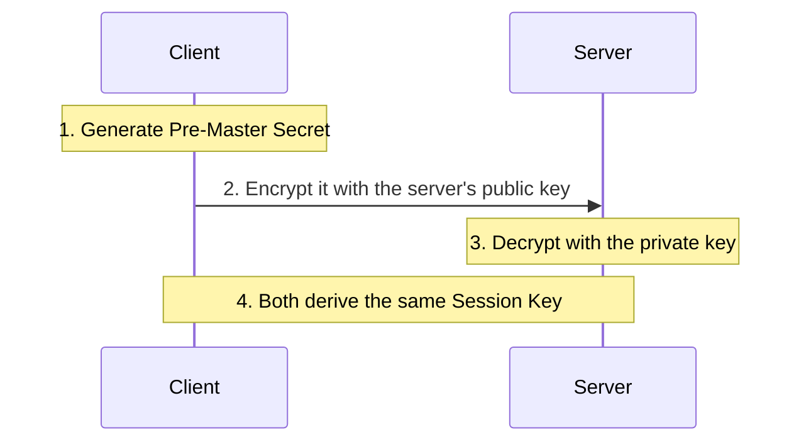

> **Note:** Modern TLS (1.2 with ECDHE, and all of TLS 1.3) uses a Diffie-Hellman key exchange rather than encrypting a pre-master secret directly. The end result is the same for our purposes — **both sides end up with an identical symmetric session key that no eavesdropper can derive.**

### 4.2 Data Transfer Phase

Once the handshake completes, all real HTTP content — request lines, JSON bodies, cookies, headers — is encrypted with the symmetric **session key**:

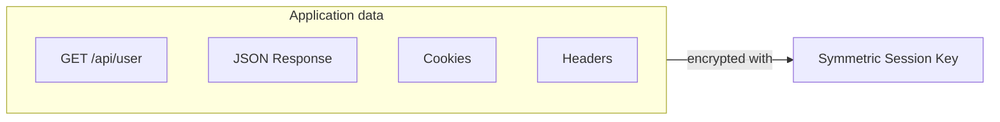

So the two kinds of keys play very different roles:

| Key Type | Purpose |
|---|---|
| Public / Private key | Establish a secure session (handshake only) |
| Symmetric session key | Encrypt the actual application data |

The takeaway: **whoever controls the handshake controls the session keys.** That is the door Charles walks through.

---

## 5. How Charles Decrypts HTTPS Traffic

The key idea in one sentence:

> Charles does **not** break HTTPS encryption. It makes the client *trust Charles as a legitimate Certificate Authority*, so it can complete its own handshake with the client and obtain its own session key.

This is a Man-In-The-Middle (MITM) attack — but one you have **authorized** on your own device by installing the Charles root certificate.

---

## 6. The HTTPS MITM Process, Step by Step

Assume the user visits `https://api.example.com`.

### Step 1: Client Connects to Charles

The device is configured to use Charles as its proxy (e.g. `192.168.1.100:8888`). To open an HTTPS connection, the client first sends:

```http
CONNECT api.example.com:443
```

A normal proxy would just open a blind TCP tunnel and forward encrypted bytes. **Charles instead intercepts the TLS negotiation** and terminates it itself.

### Step 2: Charles Generates a Fake Certificate

On the fly, Charles mints a certificate for the requested domain:

```
Subject:  api.example.com     <-- looks legitimate
Issuer:   Charles Root CA     <-- but signed by Charles, not a real CA
```

Compare the certificate chains:

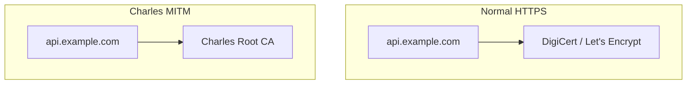

### Step 3: Client Accepts the Charles Certificate

Why does the client accept a certificate signed by "Charles Root CA"? Because you previously installed the **Charles Root Certificate** into the operating system's trust store. The OS now believes `Charles Root CA = Trusted Certificate Authority`, so a certificate for `api.example.com` signed by Charles Root CA passes validation — exactly as if it came from DigiCert.

### Step 4: Two Independent TLS Connections Are Created

This is the most important concept. Charles maintains **two separate encrypted channels** with **two different session keys**:

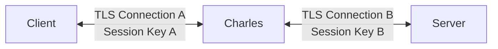

**Connection A — Client ↔ Charles**
The client believes it is talking to `api.example.com`, so it encrypts traffic with the public key from Charles's fake certificate. Charles holds the matching private key, so it can turn that ciphertext back into plain text:

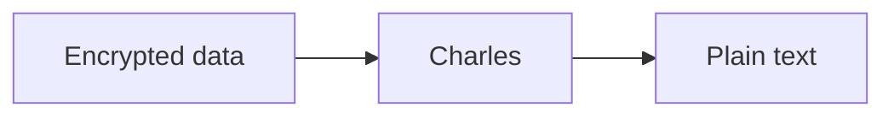

**Connection B — Charles ↔ Real Server**
Here Charles behaves like an ordinary client. It connects to the real `api.example.com`, receives the server's genuine certificate, and completes a normal, fully valid TLS handshake.

Charles now holds both session keys, so it can read and rewrite everything passing between the two sides.

---

## 7. The Complete Data Flow

**Request path:**

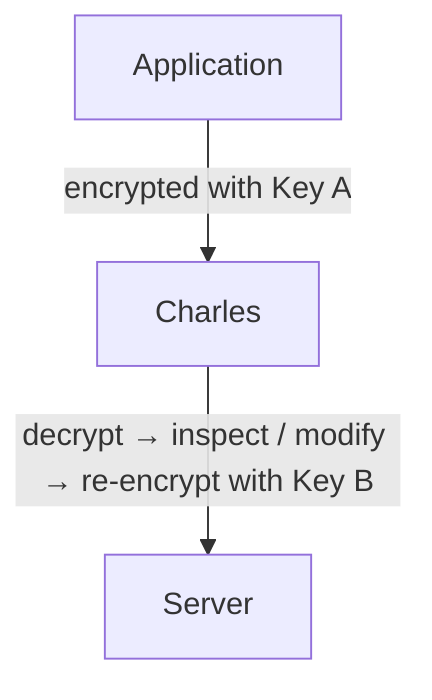

**Response path:**

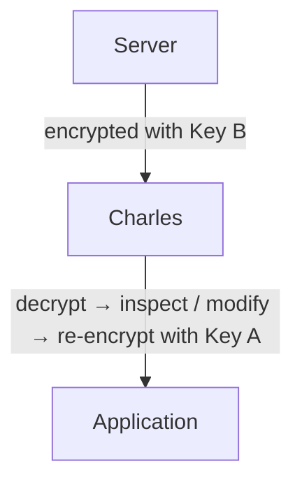

Because Charles decrypts both sides, it can:

- Read HTTPS requests and responses in plain text
- Modify API parameters
- Change headers
- Alter response bodies and status codes
- Inject test data

---

## 8. Why You Must Install the Charles Root Certificate

Without the Charles root certificate installed and trusted, the device receives:

```
Certificate: api.example.com
Issuer:      Charles Root CA
```

and the OS asks: *Is "Charles Root CA" a trusted authority?* The answer is **No**, so the connection is refused:

```
SSL Certificate Error / NET::ERR_CERT_AUTHORITY_INVALID
```

Installing and trusting the certificate is what creates the trust relationship that makes MITM inspection possible. This is also why you should **remove the certificate when you're done** — while it's installed, anything that can act as your proxy could silently decrypt your HTTPS traffic.

---

## 9. Charles Core Features

### 9.1 Request and Response Inspection

Charles displays the full picture of each transaction: URL, HTTP method, headers, request body, response body, cookies, and timing information.

### 9.2 Rewrite Rules

Automatically modify requests or responses as they pass through. For example, rewrite a version field:

```jsonc
// Original request        // After rewrite
{ "version": "1.0" }   ->  { "version": "2.0" }
```

Useful for testing new API versions, simulating server behavior, and debugging client logic without touching the backend.

### 9.3 Map Remote

Redirect traffic from one host to another, for example point a production endpoint at your local server:

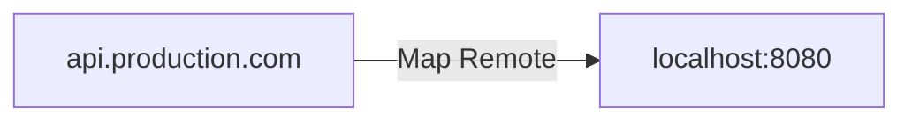

Useful for local development, testing backend changes against a real client, and environment switching.

### 9.4 Network Throttling

Simulate poor network conditions — 2G/3G speeds, high latency, packet loss:

```
Download Speed:  100 KB/s
Latency:         500 ms
```

Useful for testing mobile apps, timeout handling, and behavior under weak networks.

---

## 10. HTTPS Capture Configuration

### Step 1: Enable the Charles Proxy

`Proxy → Proxy Settings` — the default port is `8888`.

### Step 2: Install the Charles Root Certificate (desktop)

`Help → SSL Proxying → Install Charles Root Certificate`

On macOS, then trust it in Keychain Access:

1. Open **Keychain Access**
2. Find the **Charles** certificate
3. Set **Trust → Always Trust**

### Step 3: Enable SSL Proxying

`Proxy → SSL Proxying Settings`, then add a location:

```
Host:  *
Port:  443
```

Using `*` intercepts all HTTPS hosts. In practice, scope this to the specific hosts you're debugging to keep the session readable.

### Step 4: Configure the Mobile Device Proxy

On the phone's Wi-Fi settings, set **HTTP Proxy → Manual**:

```
Server:  192.168.1.100   (your computer's LAN IP)
Port:    8888
```

The phone and computer must be on the **same network**.

### Step 5: Install the Certificate on Mobile

Open `http://chls.pro/ssl` in the device browser and install the certificate.

**iOS requires an extra trust step** — after installing the profile:

```
Settings → General → About → Certificate Trust Settings
        → enable "Charles Root CA"
```

---

## 11. SSL Pinning: Why Some Apps Can't Be Captured

Some applications implement **SSL Certificate Pinning**. Instead of trusting whatever CA the system trusts, the app ships with a copy of the expected server certificate (or a hash of its public key) and checks against that directly.

**Normal HTTPS** — the app trusts any system-trusted CA, so Charles works:

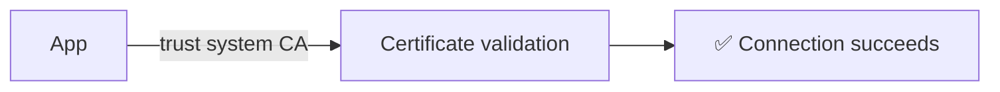

**With pinning** — the app compares the presented certificate against its hard-coded expectation and rejects anything that doesn't match:

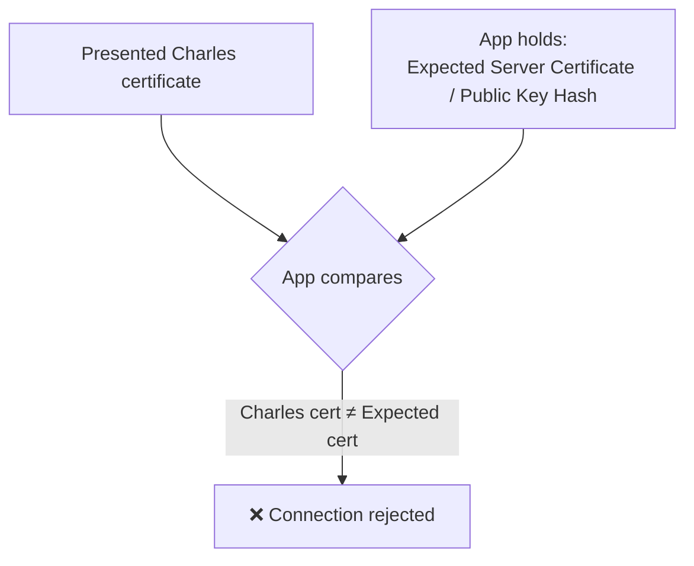

Because Charles presents its own fake certificate signed by Charles Root CA — not the real server certificate the app expects — the comparison fails and the connection is dropped. Trusting the Charles root CA at the OS level makes **no** difference here, because the app deliberately ignores the OS trust store. The MITM attempt fails.

### Working around pinning (for authorized testing only)

If you legitimately own or are authorized to test the app, common approaches include:

- **Frida / Objection** — hook and disable the pinning check at runtime on a rooted/jailbroken device or emulator.
- **Patching the app** — modify the binary or its network config to remove the pinned certificate.
- **A debug build** — many apps disable pinning in non-production builds.

None of these work on an app you don't control — which is precisely the point of pinning.

---

## 12. Troubleshooting

| Symptom | Likely cause | Fix |
|---|---|---|
| Traffic shows as `CONNECT` with an unreadable/encrypted body | SSL Proxying not enabled for that host | Add the host under `Proxy → SSL Proxying Settings` |
| `SSL handshake failed` / certificate error on device | Root certificate not installed or not trusted | Reinstall via `chls.pro/ssl`; on iOS enable it under Certificate Trust Settings |
| Phone can't reach Charles at all | Not on the same network, or firewall blocking port 8888 | Confirm same Wi-Fi; allow incoming connections to Charles |
| A specific app fails while browsers work | SSL pinning in that app | See [Section 11](#11-ssl-pinning-why-some-apps-cant-be-captured) |
| Nothing appears in Charles | Proxy not set on the device, or a VPN is bypassing it | Re-check the manual proxy config; disable conflicting VPNs |

---

## 13. Summary

Charles does not "break HTTPS encryption." Instead:

> Charles uses a trusted Root CA certificate to become a controlled middleman between client and server, creating two separate TLS connections and decrypting traffic in between.

The complete model — a normal direct connection versus the Charles MITM path:

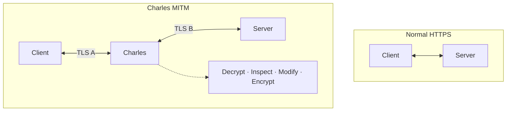

The core ideas at a glance:

| Scenario | How Charles Works |
|---|---|
| **HTTP** | Direct proxy — traffic is already readable |
| **HTTPS** | MITM using the Charles Root CA |
| **TLS** | Public key establishes the session; symmetric key encrypts the data |
| **Mobile apps** | SSL pinning may block interception entirely |

Once you understand Charles, you understand the core principle behind every other HTTPS debugging proxy — **Fiddler, mitmproxy, Burp Suite, Proxyman**, and the rest. They all rely on the same fundamental idea:

> Insert a trusted proxy into the communication path, terminate TLS on both sides, and inspect the traffic in the middle.
