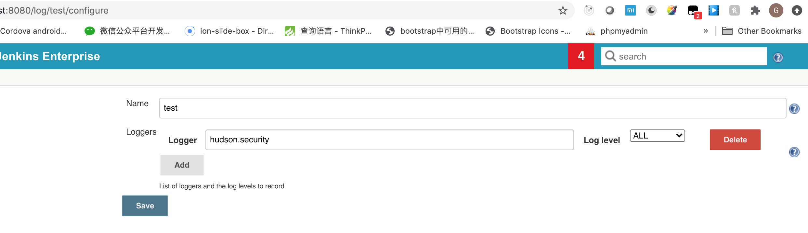

# How to debug jenkins plugins on fly?

> Background: Let's Image this situtation, your production Jenkins Master got some issue. 
> you want to know what's going on in the dark box. What happened during each build step?
> Yes, you could trace the log, but the verbosely log would overhelming you. 

There is a log feature provided by Jenkins, which could specify which level log and which class generated log, you want to check.

## Below is the details

- 1. Find out the class full name which you'd like to check.
  For exmample, I want to check the log from class: [`javaposse.jobdsl.plugin.JenkinsJobManagement`](https://github.com/jenkinsci/job-dsl-plugin/blob/b3bd3488f6c7389be8df0c7e473d0144c364a6ad/job-dsl-plugin/src/main/groovy/javaposse/jobdsl/plugin/JenkinsJobManagement.java#L67).

- 2. Create a new log recorder for specific class.
  - Go to log recorder management page: http://jenkins-home/log, and click `Add new log recorder`.
  - Fill recorder name: `phil-recorder`
  - Add Loggers 
    - Logger: `javaposse.jobdsl.plugin.JenkinsJobManagement`
    - Lovel level: `ALL`
  - Click Save
  

- 3. Go to `phil-recorder` page http://jenkins-home/log/phil-recorder to check logs generated by `JenkinsJobManagement`

