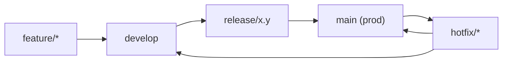
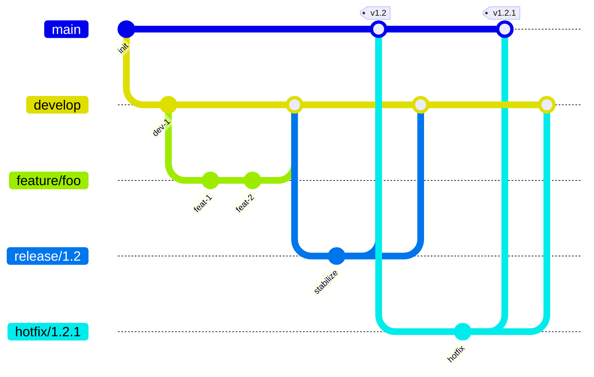
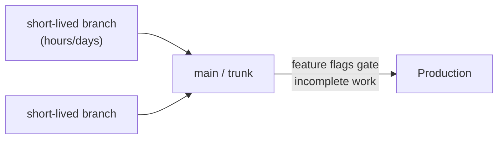
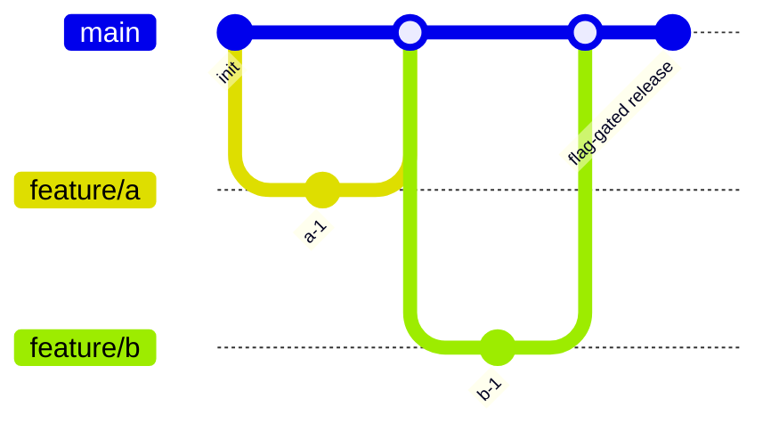
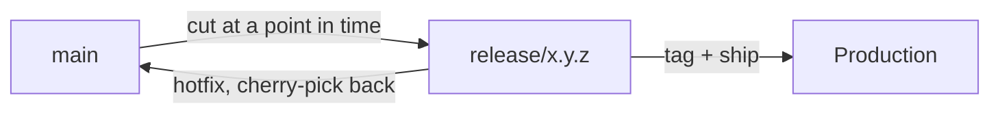
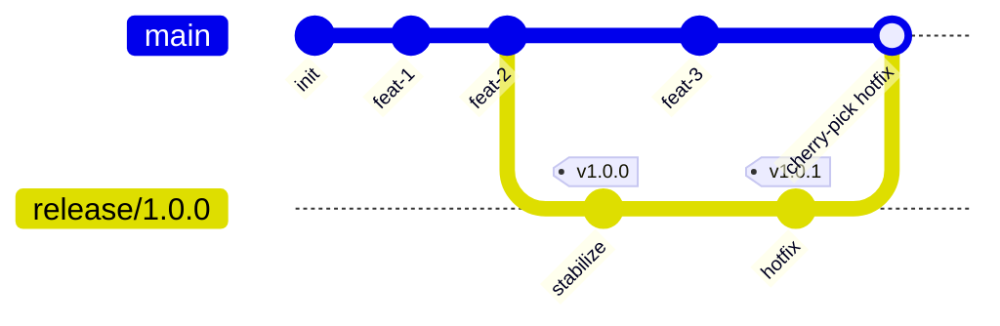
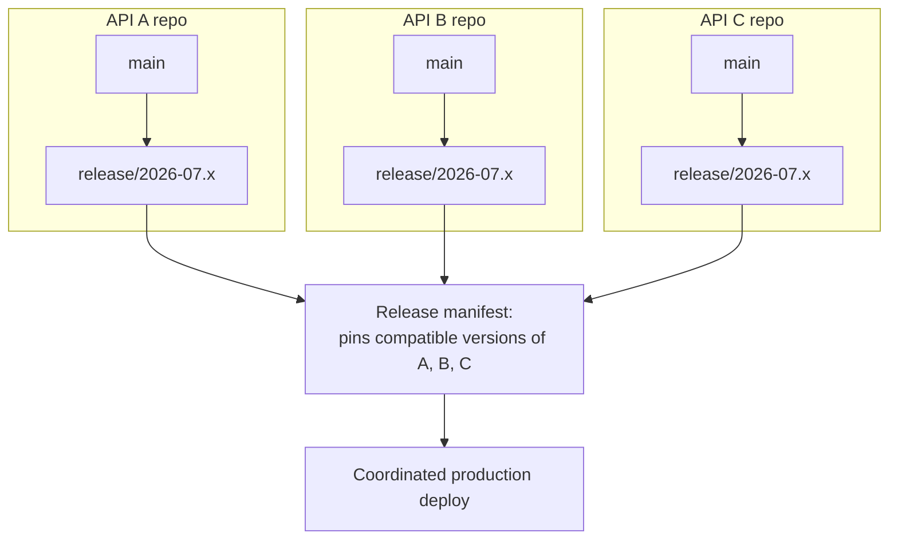

# Git Branching Strategies: Common Models, Trade-offs, and Choosing One for Correlated API Releases

Choosing a branching strategy is really choosing **how you want to answer two questions**:

1. How does in-progress work get integrated without blocking everyone else?
2. How do you get a stable, reproducible, rollback-able snapshot into production — especially when "production" means several interdependent services shipping together?

This document walks through the commonly used strategies, their trade-offs, and which one fits a scenario where several **correlated APIs** need to be released as a coordinated, versioned set.

---

## Table of Contents

1. [Git Flow](#1-git-flow)
2. [GitHub Flow](#2-github-flow)
3. [GitLab Flow](#3-gitlab-flow)
4. [Trunk-Based Development](#4-trunk-based-development)
5. [Release Branching](#5-release-branching)
6. [Comparison at a Glance](#6-comparison-at-a-glance)
7. [Releasing a Set of Correlated APIs](#7-releasing-a-set-of-correlated-apis)
8. [Summary](#8-summary)

---

## 1. Git Flow



Commit-level view:



`main` always reflects what's in production. `develop` is the integration branch. Features branch off `develop`; releases are stabilized on their own `release/*` branch before merging to both `main` and back into `develop`; `hotfix/*` branches patch `main` directly and get merged back into both.

| Pros | Cons |
|---|---|
| Very structured — clear separation of in-progress, stabilizing, and released code | Heavyweight: many long-lived branches, frequent merges |
| Hotfixes handled cleanly without disturbing in-flight `develop` work | Slows down continuous delivery |
| Good fit for software with formal, infrequent release cycles | Overkill for teams shipping multiple times a day |

---

## 2. GitHub Flow


Commit-level view:

```mermaid
gitGraph
    commit id: "init"
    branch feature/foo
    checkout feature/foo
    commit id: "feat-1"
    commit id: "feat-2"
    checkout main
    merge feature/foo id: "PR merge + deploy"
    branch feature/bar
    checkout feature/bar
    commit id: "feat-1"
    checkout main
    merge feature/bar id: "PR merge + deploy"
```

One long-lived branch (`main`), short-lived feature branches, merged via pull request, deployed straight from `main`.

| Pros | Cons |
|---|---|
| Simple, low overhead, matches CI/CD naturally | No real concept of a "release" as a distinct, named artifact |
| Fast feedback loop | Hard to run multiple versions in production simultaneously |
| Easy to reason about — one branch, one truth | Risky for anything that isn't continuously deployed straight after merge |

---

## 3. GitLab Flow


Commit-level view:

```mermaid
gitGraph
    commit id: "init"
    branch staging
    branch production
    checkout main
    commit id: "feat-1"
    commit id: "feat-2"
    checkout staging
    merge main id: "promote to staging"
    checkout production
    merge staging id: "promote to production"
```

A middle ground: either environment branches (`staging`, `production`) or versioned `release/x.y` branches sit between `main` and deployment, giving a staged promotion path without Git Flow's full ceremony.

| Pros | Cons |
|---|---|
| Supports staged rollout and versioned releases | Still requires discipline about what merges where |
| Less overhead than Git Flow | More moving parts than GitHub Flow |

---

## 4. Trunk-Based Development



Commit-level view:



A single trunk, very short-lived feature branches, incomplete work hidden behind feature flags rather than isolated on a branch.

| Pros | Cons |
|---|---|
| Minimizes merge conflicts, enables true continuous integration | Requires strong feature-flag discipline and test coverage |
| Fast feedback | No natural "cut point" for a formal release unless paired with release branches |

---

## 5. Release Branching



Commit-level view:



Often layered on top of trunk-based development or Git Flow. A `release/x.y.z` branch is cut from `main`, stabilized and tested independently, then tagged and shipped. Fixes found during stabilization are cherry-picked back to `main`.

| Pros | Cons |
|---|---|
| Gives a stable, immutable snapshot to certify, roll back to, or patch | Cherry-picking between `main` and release branches is manual and error-prone without discipline |
| Supports maintaining multiple versions in production at once | Extra branch bookkeeping compared to pure trunk-based |

---

## 6. Comparison at a Glance

| Strategy | Release cadence fit | Multi-version support | Overhead |
|---|---|---|---|
| Git Flow | Infrequent, formal releases | Strong | High |
| GitHub Flow | Continuous deployment | Weak | Low |
| GitLab Flow | Staged/versioned releases | Moderate | Medium |
| Trunk-Based Development | Continuous integration | Weak (needs pairing with release branches) | Low |
| Release Branching | Formal, coordinated releases | Strong | Medium |

---

## 7. Releasing a Set of Correlated APIs

The problem being solved here isn't "how do I branch one repo" — it's:

> How do I guarantee a specific, tested combination of API versions goes to production together, and can be rolled back or hotfixed **as a unit**?

That framing rules out pure GitHub Flow (no stable cross-service certification point) and full Git Flow (the `develop` branch adds ceremony that doesn't help cross-repo coordination). The fit is:

### Trunk-based development day-to-day + a coordinated release branch per correlated release

- Each API repo stays trunk-based: `main` + short-lived feature branches, merged via PR — keeps velocity high, avoids Git Flow's merge overhead.
- When a *set* of correlated APIs is ready to certify together, cut `release/2026-07.x` (or a semver tag) in each repo at a mutually compatible commit. This branch/tag set is the coordinated, testable, immutable bundle that gets promoted through staging to production.
- Hotfixes land on the release branch and get cherry-picked back to `main`, so a production incident doesn't force shipping unrelated in-flight work.
- Because the APIs are versioned against each other (e.g. API A v2.3 only works with API B v1.9+), record the **compatible-set mapping** explicitly — a release manifest, compose file, or dependency matrix — rather than relying on branch names alone to convey compatibility.



### If the APIs live in a monorepo

A single `release/*` branch cut across all of them atomically replaces the need for cross-repo version bookkeeping entirely — worth moving to if coordination overhead becomes painful.

---

## 8. Summary

| Scenario | Recommended strategy |
|---|---|
| Small team, continuous deployment, single service | GitHub Flow |
| Staged rollout across environments | GitLab Flow |
| Infrequent, formal releases, need strict release/hotfix separation | Git Flow |
| High-velocity CI with feature flags | Trunk-Based Development |
| **Coordinated release of several correlated APIs** | **Trunk-based day-to-day + a release branch/tag cut per coordinated release, tied together by an explicit compatibility manifest** |

The common thread: branching strategy alone never guarantees cross-service compatibility — it only gives you the *cut points*. The compatibility guarantee itself has to live in an explicit manifest or dependency matrix that ties each service's release branch/tag to the others it was tested against.
