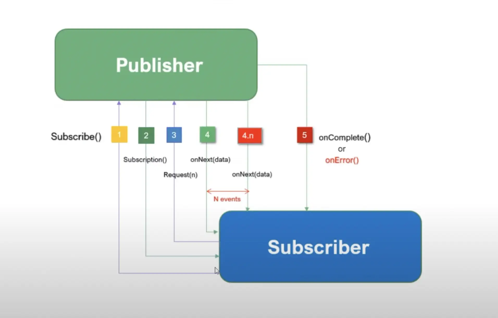

# Reative flow



## Mono

Mono is a special type of Publisher. A Mono object represents a single or empty value. This means it can emit only one value at most for the onNext() request and then terminates with the onComplete() signal. In case of failure, it only emits a single onError() signal.


```java
@Test
public void givenMonoPublisher_whenSubscribeThenReturnSingleValue() {
    Mono<String> helloMono = Mono.just("Hello");
    StepVerifier.create(helloMono)
      .expectNext("Hello")
      .expectComplete()
      .verify();
}
```

## Flux

Flux is a standard Publisher that represents 0 to N asynchronous sequence values. This means that it can emit 0 to many values, possibly infinite values for onNext() requests, and then terminates with either a completion or an error signal.

### Flux with a completion signal

```java
@Test
public void givenFluxPublisher_whenSubscribedThenReturnMultipleValues() {
    Flux<String> stringFlux = Flux.just("Hello", "Baeldung");
    StepVerifier.create(stringFlux)
      .expectNext("Hello")
      .expectNext("Baeldung")
      .expectComplete()
      .verify();
}
```

### Flux with an error signal

```java
@Test
public void givenFluxPublisher_whenSubscribeThenReturnMultipleValuesWithError() {
    Flux<String> stringFlux = Flux.just("Hello", "Baeldung", "Error")
      .map(str -> {
          if (str.equals("Error"))
              throw new RuntimeException("Throwing Error");
          return str;
      });
    StepVerifier.create(stringFlux)
      .expectNext("Hello")
      .expectNext("Baeldung")
      .expectError()
      .verify();
}
```

## References

- https://www.baeldung.com/reactor-core
- https://www.baeldung.com/java-reactor-flux-vs-mono
- https://www.baeldung.com/java-string-from-mono
- https://www.youtube.com/watch?v=ckfqcfzCg3w
- https://github.com/geekchow/spring-demo-reactive
- https://projectreactor.io/docs/core/release/api/reactor/core/publisher/Mono.html
