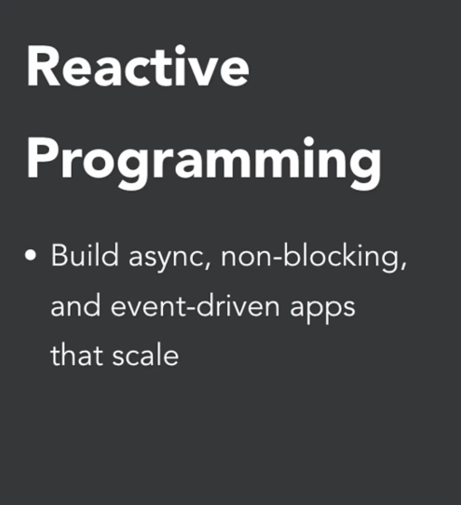
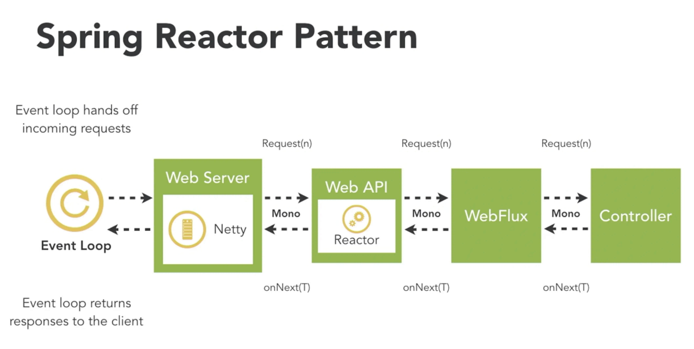
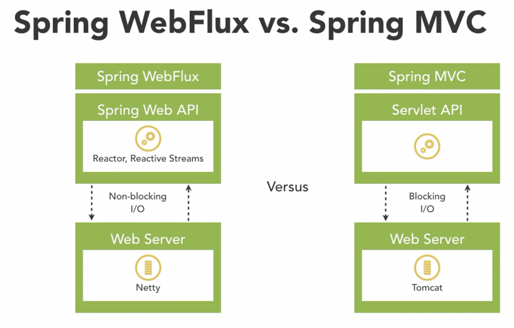
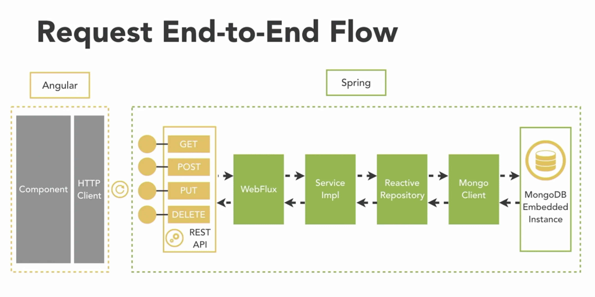
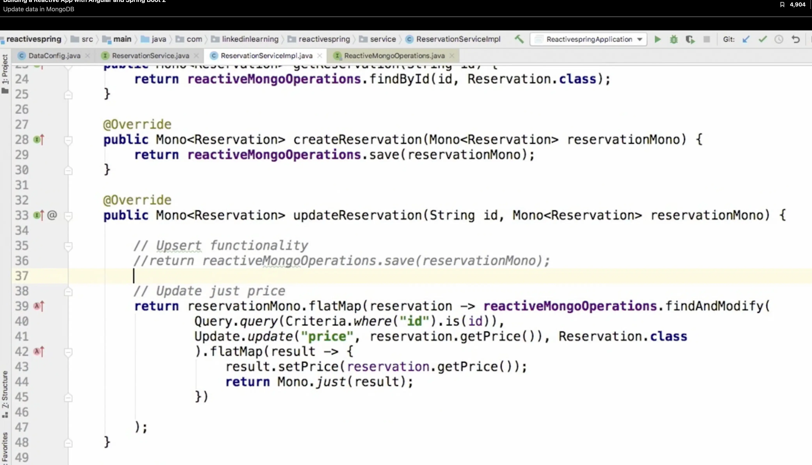

# Reactive Programming with Spring 5

## Basic Concepts

## References

- https://projectreactor.io/learn
- https://developer.okta.com/blog/2018/09/21/reactive-programming-with-spring
- https://github.com/geekchow/spring-boot-sampe.git