# How WebFlux improve I/O bound web service througout via async threading

## 0 Concept Explanation

### 0.1 Sync thread mode of servlet

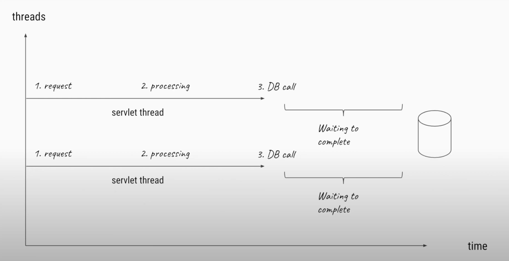

### 0.2 Limitation of sync servlet thread mode

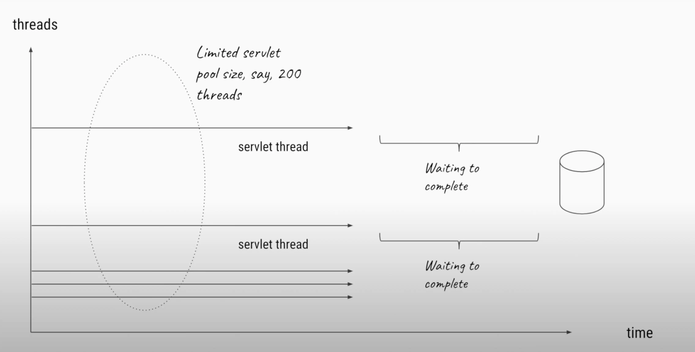

### 0.3 Async thread mode of WebFlux

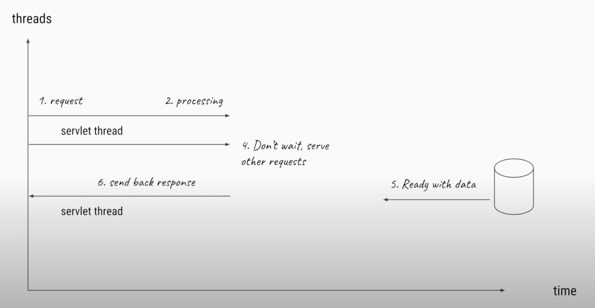

### 0.4 Event Loop with thread pool

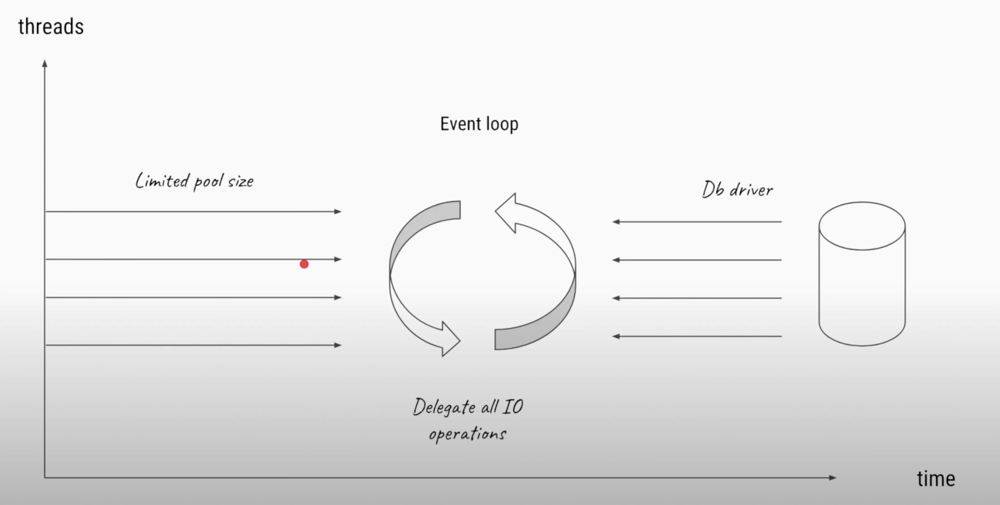

### 0.5 Event loop with one thread per cpu core

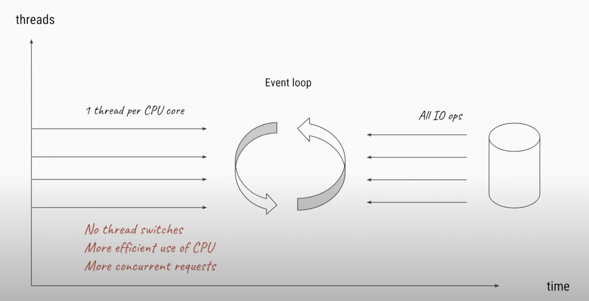

### 0.6 Event loop: thread pool vs thread per cpu core

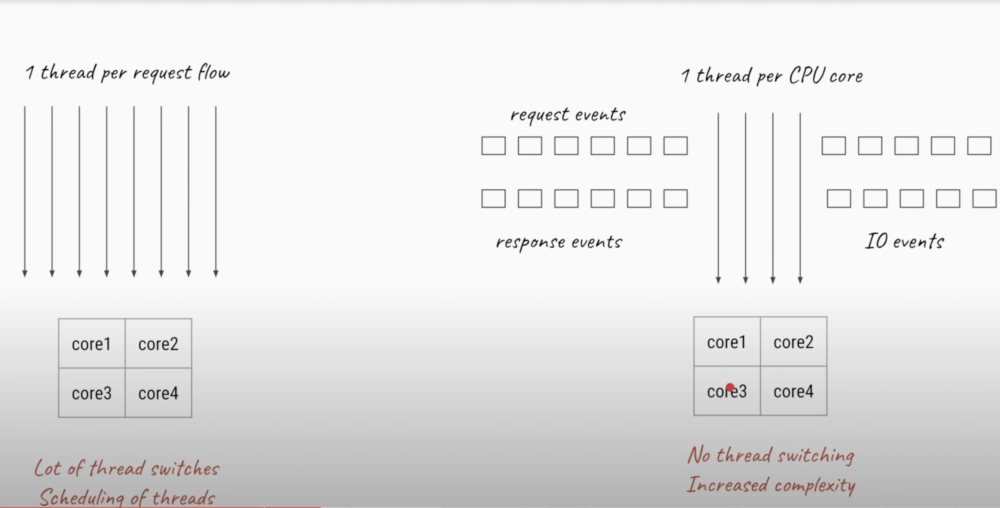

### 0.7 End to end async 

> Caution: The whole end to end link should be async, otherwise it's degraded to sync mode.

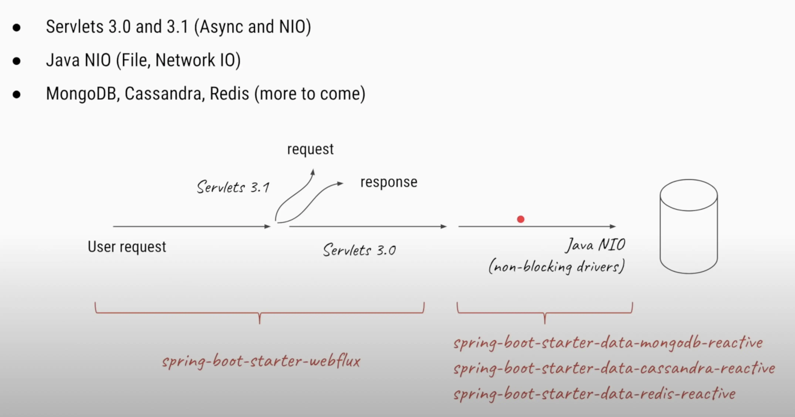

## 1 Implementation 

### 1.1 The traditional blocking mode with servlet

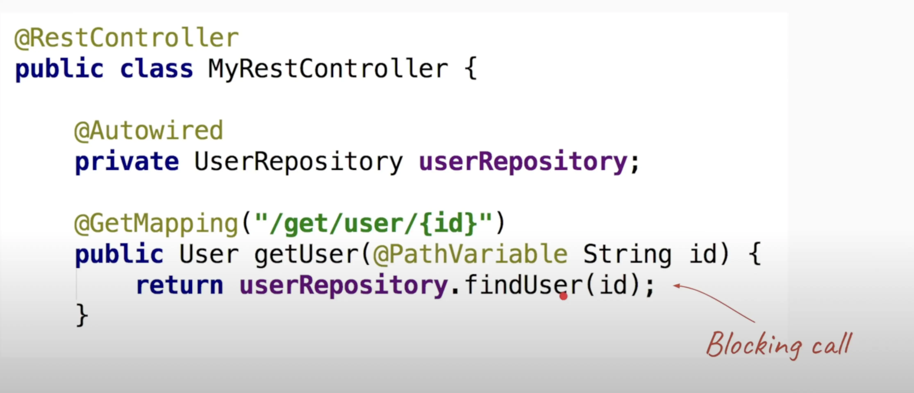

### 1.2 Future as placeholder

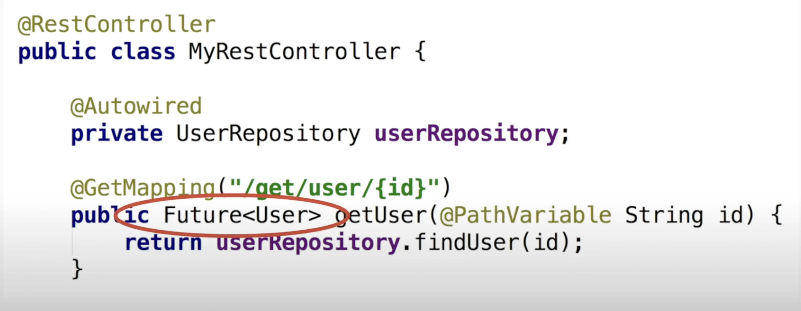

### 1.3 Computable<Future> as placeholder

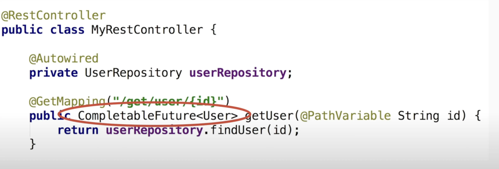

### 1.4 Mono & Flux as placeholder

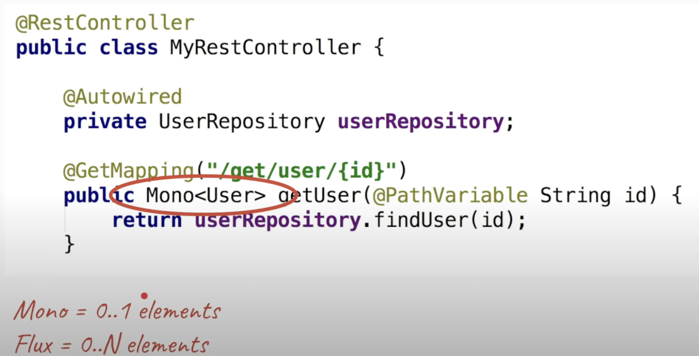

### 1.5 Get continous stream data implementation 

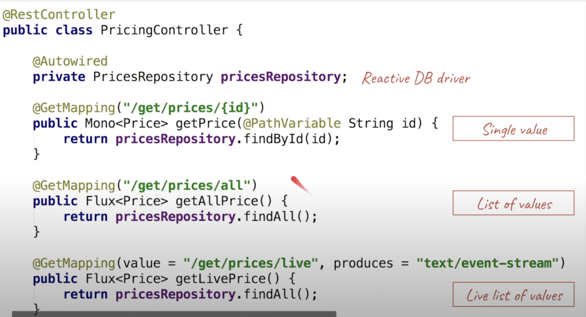

### 1.6 Get continous stream data concept 

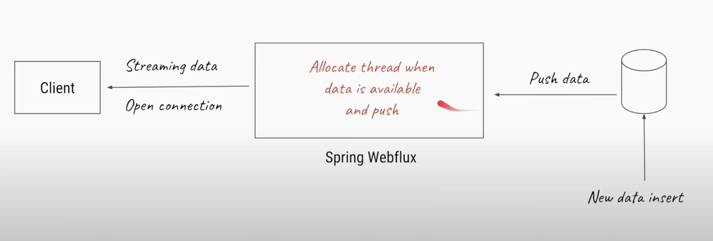

### 1.7 Put continous stream data implementation 

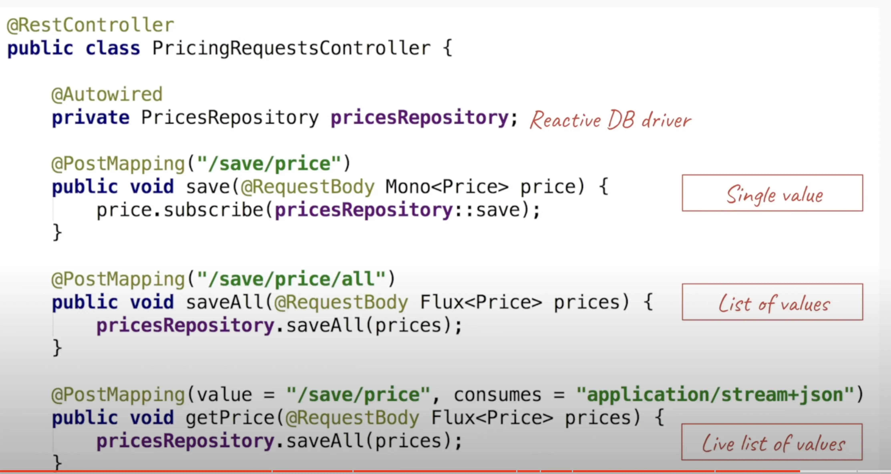

### 1.8 Put continous stream data concept 

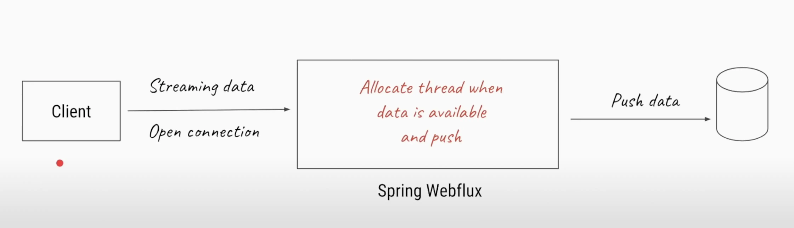

## 2 Conclusion

### 2.1 Advantages of webflux

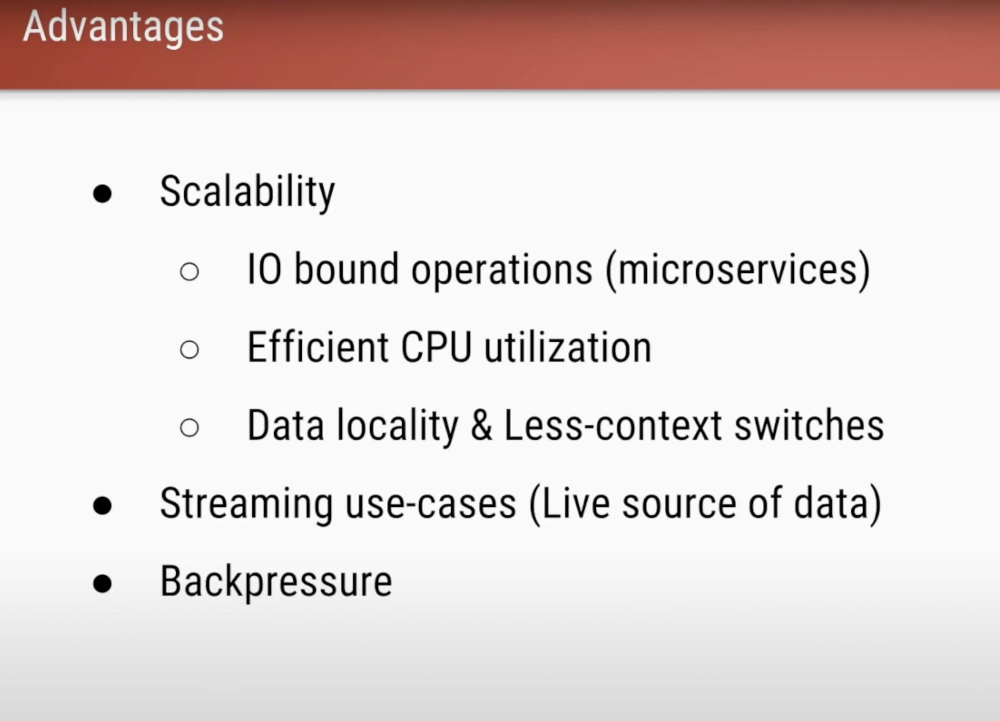

### 2.2 Considerations of webflux

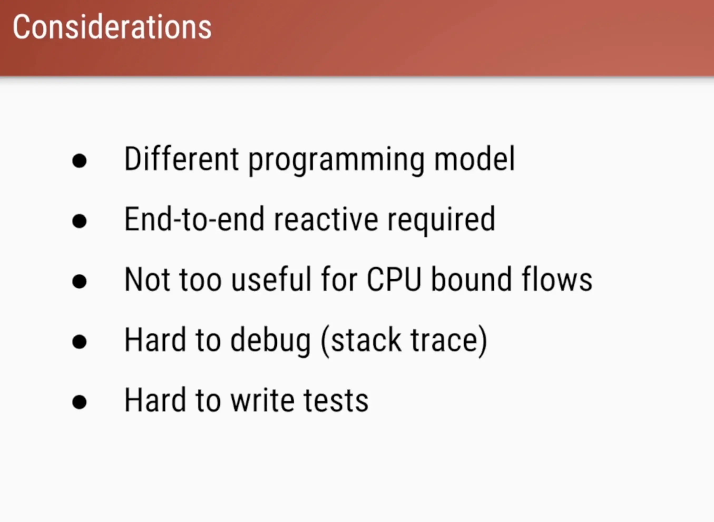

> References
- https://www.youtube.com/watch?v=M3jNn3HMeWg&t=71s