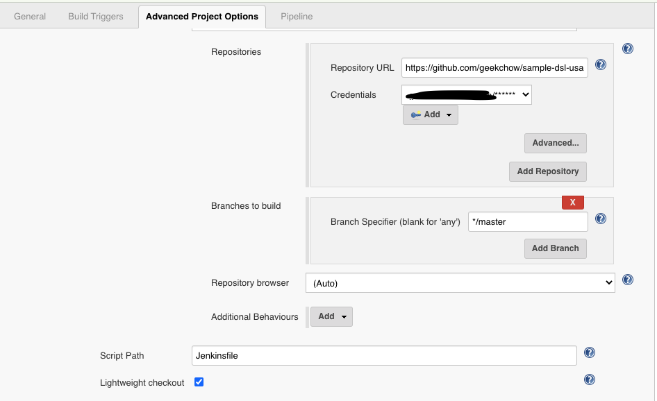

# Make Jenkins pipeline in `configuration as infrastructure` way with job-dsl-plugin

## What is job-dsl-plugin?
Job DSL was one of the first popular plugins for Jenkins which allows managing configuration as code and many other plugins dealing with this aspect have been created since then, most notably the Jenkins Pipeline and Configuration as Code plugins. It is important to understand the differences between these plugins and Job DSL for managing Jenkins configuration efficiently.

## How to make a seed pipeline to seed other pipeline?

Scenario 1: Create a pipeline job manually
- Step 1: Create a new repo with Jenkinsfile
```groovy
// file: Jenkinsfile 
// repo: sample-scripted-pipeline
node {
   echo "It's a sampe scripted pipeline"
}
```

- Step 2: Create a new `pipeline` base on previous repo manually



> Goto the `./job/pipleine-test-script/config.xml` to check the xml config.
```xml
<flow-definition plugin="workflow-job@2.37">
<actions/>
<description/>
<keepDependencies>false</keepDependencies>
<properties>
<hudson.plugins.jira.JiraProjectProperty plugin="jira@3.0.13"/>
</properties>
<definition class="org.jenkinsci.plugins.workflow.cps.CpsScmFlowDefinition" plugin="workflow-cps@2.80">
<scm class="hudson.plugins.git.GitSCM" plugin="git@4.2.2">
<configVersion>2</configVersion>
<userRemoteConfigs>
<hudson.plugins.git.UserRemoteConfig>
<url>https://github.com/geekchow/sample-scripted-pipeline.git</url>
<credentialsId>token-for-github</credentialsId>
</hudson.plugins.git.UserRemoteConfig>
</userRemoteConfigs>
<branches>
<hudson.plugins.git.BranchSpec>
<name>*/master</name>
</hudson.plugins.git.BranchSpec>
</branches>
<doGenerateSubmoduleConfigurations>false</doGenerateSubmoduleConfigurations>
<submoduleCfg class="list"/>
<extensions/>
</scm>
<scriptPath>Jenkinsfile</scriptPath>
<lightweight>true</lightweight>
</definition>
<triggers/>
<disabled>false</disabled>
</flow-definition>
```


Scenario 2: Create pipeline from a seed pipeline: `sample-seed-pipeline` with scriptText approach

- Step 1: Create seed pipeline
```groovy
// file: Jenkinsfile
def jobDefinition = '''
pipelineJob('sample-child-pipeline') {
  definition {
    cpsScm {
      scm {
        git {
          remote {
            url('https://github.com/geekchow/sample-scripted-pipeline.git')
            credentials('token-for-github')
          }
          branch('*/master')
        }
      }
      scriptPath('Jenkinsfile')
      lightweight()
    }
  }
}
'''

node('master') {
    step([
          $class: 'ExecuteDslScripts',
          scriptText: jobDefinition,
          lookupStrategy: 'SEED_JOB'
    ])
}
```

> To make the dsl pipeline definition readable we could seperate the job Definition into a groovy file.

```groovy
// file: Jenkinsfile
node('master') {
    
    checkout(scm)
    
    step([
          $class: 'ExecuteDslScripts',
          targets: 'SeedPipeline.groovy',
          lookupStrategy: 'SEED_JOB'
    ])
}
```

```groovy
// file: SeedPipeline.groovy
pipelineJob('sample-child-pipeline') {
  definition {
    cpsScm {
      scm {
        git {
          remote {
            url('https://github.com/geekchow/sample-scripted-pipeline.git')
            credentials('token-for-github')
          }
          branch('*/master')
        }
      }
      scriptPath('Jenkinsfile')
      lightweight()
    }
  }
}
```

- Step 2: Run seed pipeline to fork a new pipeline
The new pipeline `sample-child-pipeline` was created by the sample seed pipeline.

Source code: https://github.com/geekchow/sample-seed-pipeline.git

## Reference

http://job-dsl.herokuapp.com/

https://jenkinsci.github.io/job-dsl-plugin/

https://github.com/jenkinsci/job-dsl-plugin/blob/master/job-dsl-plugin/src/main/groovy/javaposse/jobdsl/plugin/ExecuteDslScripts.java
