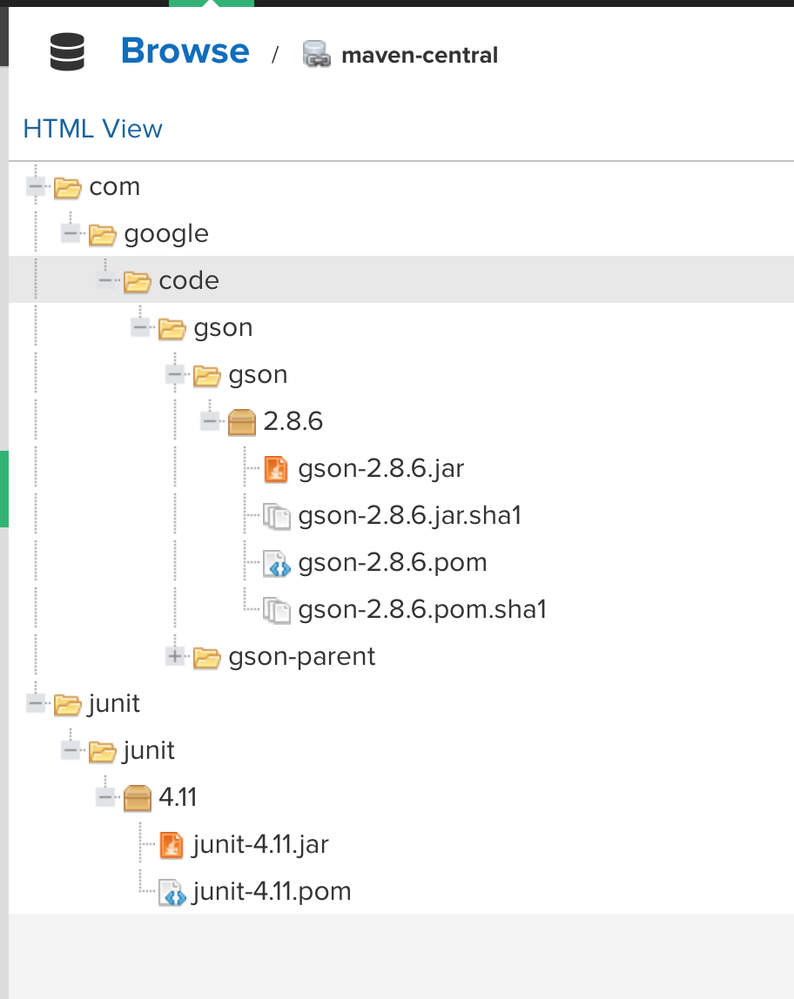

# Sonatype Nexus Repository Manager 

> The free artifact repository with universal format support.

We could use Nexus to release/distribution internal packages, and also it could cache 
packages from offical central repositories, save time and network bandwith for company.

Let's do a sample to demostrate how to make use of proxy repository to cache packages.

- 1. Setup a nexus server.  
  Thanks to docker don't have to setup from stratch, we can use docker image to start a nexus server quickly.
  
  ```bash
  # get sonatype/nexus3 image
  docker pull sonatype/nexus3

  # run a container: nexus base on that image
  docker run -d -p 8081:8081 --name nexus sonatype/nexus3

  # list all running containers
  docker container list

  # ssh to the nexus container and fetch the admin password
  docker exec -it nexus /bin/bash
  cat /nexus-data/admin.password

  # then goto page http://localhost:8081/#browse/ logon with credential admin:pwd
  ```
  By default it already has three respoistories running.

  | Name | Type | Purpose |
  |:----:|:----:|:----:|
  | maven-contral | proxy | A repository that proxies everything you download from Maven Central. Next time you download the same dependency, it will be cached in your Nexus. |
  | maven-release | hosted | A repository for Maven artifacts that you deploy with -SNAPSHOT in the end of the version tag of your pom.xml `<version>1.0.0</version>` |
  | maven-snapshots | hosted | A repository for Maven artifact that you deploy without -SNAPSHOT in the end of the version tag of your pom.xml: `<version>1.0.0-SNAPSHOT</version>` |
  | maven-public | group | This will group all the above repos and provide you a single URL to configure your clients to download from/deploy to.|

  At the very beginning, since no request is made this nexus server, so there is no packages under `maven-central`.  

- 2. Setup maven global settings file to refer our nexus repository.
  Edit ~/.m2/settings.xml add nexus repository
  ```xml
  <?xml version="1.0" encoding="UTF-8"?>
  <settings xmlns="http://maven.apache.org/SETTINGS/1.1.0"
  xmlns:xsi="http://www.w3.org/2001/XMLSchema-instance"
  xsi:schemaLocation="http://maven.apache.org/SETTINGS/1.1.0 http://maven.apache.org/xsd/settings-1.1.0.xsd">

  <servers>
    <server>
      <id>nexus-snapshots</id>
      <username>admin</username>
      <password>admin123</password>
    </server>
    <server>
      <id>nexus-releases</id>
      <username>admin</username>
      <password>admin123</password>
    </server>
  </servers>

  <mirrors>
    <mirror>
      <id>central</id>
      <name>central</name>
      <url>http://localhost:8081/repository/maven-public/</url>
      <mirrorOf>*</mirrorOf>
    </mirror>
  </mirrors>

  </settings>
  ```  

- 3. Create a sample maven project  
  - 1. Create a maven project.
    ```bash
    # create sample maven project.
    mvn archetype:generate -DgroupId=com.mycompany.app -DartifactId=my-app -DarchetypeArtifactId=maven-archetype-quickstart -DarchetypeVersion=1.4 -DinteractiveMode=false
    ```
  - 2. Specify local nexus repository.  
    ```xml
    <project>
      ....
      <repositories>
        <repository>
          <id>maven-central</id>
          <url>http://localhost:8081/repository/maven-central/</url>
        </repository>
      </repositories>
    </project>
    ```
  - 3. Package the project verify that packages are download from nexus server.  
    put some dependencies into `pom.xml` file  

    ```xml
      <dependencies>
      <dependency>
        <groupId>com.google.code.gson</groupId>
        <artifactId>gson</artifactId>
        <version>2.8.6</version>
      </dependency>
      <dependency>
        <groupId>junit</groupId>
        <artifactId>junit</artifactId>
        <version>4.11</version>
        <scope>test</scope>
      </dependency>
    </dependencies>
    ```
  
    `mvn package`

    Observe the download url, it should like this:
    
    ```bash
    [INFO] --------------------------------[ jar ]---------------------------------
    Downloading from maven-central: http://localhost:8081/repository/maven-central/com/google/code/gson/gson/2.8.6/gson-2.8.6.pom
    Downloaded from maven-central: http://localhost:8081/repository/maven-central/com/google/code/gson/gson/2.8.6/gson-2.8.6.pom (2.5 kB at 378 B/s)
    Downloading from maven-central: http://localhost:8081/repository/maven-central/com/google/code/gson/gson-parent/2.8.6/gson-parent-2.8.6.pom
    Downloaded from maven-central: http://localhost:8081/repository/maven-central/com/google/code/gson/gson-parent/2.8.6/gson-parent-2.8.6.pom (4.4 kB at 7.6 kB/s)
    Downloading from maven-central: http://localhost:8081/repository/maven-central/com/google/code/gson/gson/2.8.6/gson-2.8.6.jar
    Downloaded from maven-central: http://localhost:8081/repository/maven-central/com/google/code/gson/gson/2.8.6/gson-2.8.6.jar (240 kB at 166 kB/s)
    ```
    Yep, packages are downloaded from the local nexus server.

    Verify if the package works
    ```bash
    java -cp target/my-app-1.0-SNAPSHOT.jar com.mycompany.app.App

    # output: Hello World!
    ```

    Browse the `maven-central` repository, you could see `gson` & `junit` packages are cached. 
    

## references
https://blog.sonatype.com/using-nexus-3-as-your-repository-part-1-maven-artifacts
https://maven.apache.org/guides/getting-started/maven-in-five-minutes.html
https://github.com/google/gson
