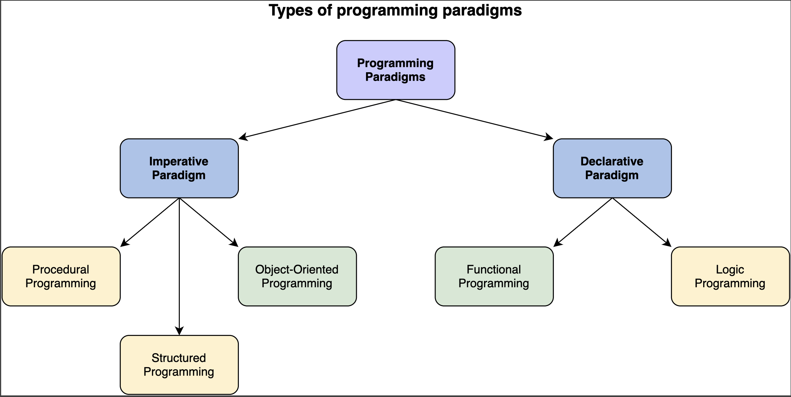
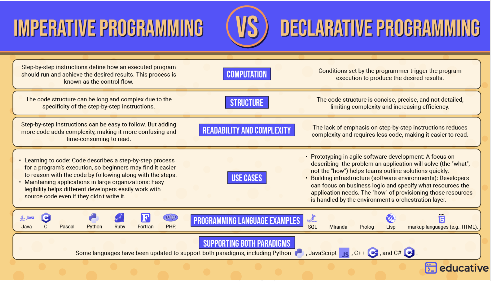

# Declarative vs imperative programming



## What is imperative programming?
Imperative programming is the oldest and most basic programming approach. Within the imperative paradigm, code describes a step-by-step process for a program’s execution. Because of this, beginners often find it easier to reason with imperative code by following along with the steps in the process.

The step-by-step process contains individual statements, instructions, or function calls. In the programming world, this process is called the control flow.

In other words, you’re interested in how the program runs, and you give it explicit instructions. Let’s illustrate this with a pseudocode example.

Say you want to build an app that returns the current weather and forecast for a given location. At a high level, you might design the app to work something like this when using an imperative approach:

```shell
Begin
Accept location from user input of either location name or ZIP code.
Call OpenWeather's Geocoding API to convert location data into geographic coordinates.
Call OpenWeather's Current Weather Data API.
Send geographic coordinates to OpenWeather. 
Call OpenWeather's Daily Forecast 16 Days API.
Resend geographic coordinates.
Parse JSON returned by the APIs to extract current weather and forecast data. 
Return current weather and forecast.
Display current weather and forecast to user.
End
```

In this simple example, imperative instructions dictate what the app should do, when to do it, and how to do it. This pseudocode is comparable to imperative programming, with which you create the logic of the program by making looping statements, calling functions, etc., all in a particular order.

## What is declarative programming?

In contrast with imperative programming, declarative programming describes what you want the program to achieve rather than how it should run.

In other words, within the declarative paradigm, you define the results you want a program to accomplish without describing its control flow. Ultimately, it’s up to the programming language’s implementation and the compiler to determine how to achieve the results. This places emphasis not on the execution process, but on the results and their ties to your overall goal. In other words, writing declarative code forces you to ask first what you want out of your program. Defining this helps you develop more expressive and explicit code.

Returning to our weather app example, the pseudocode might look something like this in the declarative paradigm:

```shell
Begin
Location submitted by user is location name or ZIP code.
Location is converted into geographic coordinates.
Weather data is retrieved for geographic coordinates.
Weather data is displayed for user.
End
```

As shown, the pseudocode is descriptive but lacks in detail. Only the result, displaying the weather data, matters to you without regard for the process.



[origin](https://www.educative.io/blog/declarative-vs-imperative-programming)