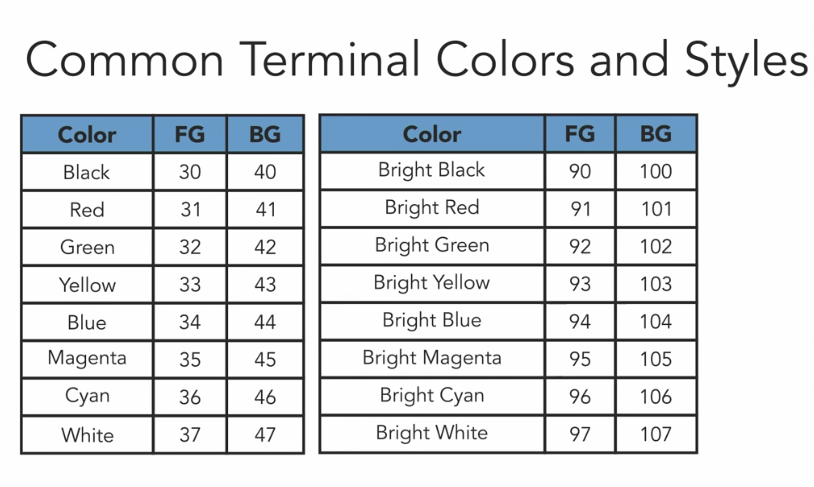

# Bash

## Definition of shell
Bash is a shell, and the commands it provides can be used either interactively at the command line, or composed into scripts, which can be run like regular programs.

### Key elements of bash


- Shebang
```shell
#!/usr/bin/env bash

```

- Bash builtins

Bash builtins provide us a platform of standard commands we can be sure will be available.

- brace expansion

Brace expansion is used to create alphanumeric sequences, and to substitute values from a list in a script.
    eg:
    ```shell
    echo {1..20..2}
    ```
    This will result in the sequence "1 3 5 7 9 11 13 15 17 19".

- command substitution

Command substitution is used to get values from other programs into our program.
In other word, run a command or command pipeline, and then return the output of that to bash, as a string of text or as a variable

> Expansions and substitutions allow us to tell Bash to generate or calculate a value that may not be known before the script runs

```shell
# The single quotes prevent Bash from performing the command substitution.
echo 'The kernel release is $(uname -r).'
# output:
# 'The kernel release is $(uname -r).'

echo "The kernel release is $(uname -r)."
# The kernel release is 21.6.0.
```

### Variables

decorator for variables
```shell
declare -r myname="Phil"
echo $myname
# would get error, and the value remains.
myname="Zhou"
echo $myname

declare -l mynamelower="Phil"
echo $mynamelower

declare -u mynameupper="Phil"
echo $mynameupper

```

env variables
```
printenv
```

### Math with bash

Bash can only do integer math, not decimal or fractional.

```shell
echo $((4+5))
echo $((2**2))
echo $((4/5))

a=5
echo $a
# out: 5
((a+=2))
echo $a
# out: 7
((a++))
echo $a
# out: 8
((a--))
echo $a
# out: 7

declare -i age=2
```

How to do decimal & fractional caculation

```shell
echo "scale=2; 4/5" | bc
# output: .80

declare -i a=2
declare -i b=3

c=$(echo "scale=5; $a/$b" | bc)
echo $c
# output: .66666

#RANDOM
echo $RANDOM
#output: generate a random value: 5162, 30544 ...

echo $(($RANDOM % 10 + 1))

```

### compare values with tests

[ ... ] is alias for test and or evaludate expresssions.

```shell
[ -d /bin/bash ]; echo $?
# ouput: 1
[ -d /bin/ ]; echo $?
# output: 0

# print out the manual of test cmd
man test

# less than operator
[ 4 -lt 3 ]; echo $?
# output: 1

# greater than operator
[ 3 -gt 1 ]; echo $?
#output: 0

# nor operator
[ ! 3 -gt 1 ]; echo $?
# output: 1
```

[[ ... ]] extended test
```shell
# combine multiple experssion
# -d: if a directory exist
# -a: if a file exist
[[ -d ~ && -a /bin/phil ]]; echo $?
#output: 1

[[ -d ~ || -a /bin/phil ]]; echo $?
#output: 0

# string fuzzy math
[[ "cat" =~ c.* ]]; echo $?
#output: 0
[[ "bat" =~ c.* ]]; echo $?
#output: 1

#judge if a variable is empty
[ -z $myfile ]; echo $?
# output:
# 0
```

### Formatting & styling string

`echo -e`: escape characters \t \n \a and other contral characters.

```shell
echo -e "Name\t\tAge"; echo -e "Phil\t\t30"
# output:
# Name            Age
# Phil            30

# make an alert sound
echo -e "\a"

# color the text
# \033: color direct delimiter
# 32: foreground color -> green; 
# 41: background color -> red:
# 0m: end of color direct
echo -e "\033[32;41mHello World\033[0m"

```




`printf "..."`: Output text using placeholder and formatting.

```shell
name="Phil"; age=30; printf "My name is %s, I'm %d age now\n" $name $age
#output: 
#My name is Phil, I'm 30 age now


# %10s take 10 positions and padding with space.
# %05d take 5 positions and padding with 0
name="Phil"; age=30; printf "My name is %10s, I'm %05d age now\n" $name $age
#output
#My name is       Phil, I'm 00030 age now

# format date
# print current time
echo $(date)
# output: 
# 2022年10月30日 星期日 17时20分26秒 CST

# print date as seconds since 1979-01-01:00:00:00
echo $(date +%s)
# output:
#1667121708

# convert date time to kind of 2020-08-10 12:00:23
# doesn't work on mac.
printf "%(%Y-%m-%d %H:%M:%S)T\n" $(date +%s)

# for mac 
date '+%Y-%m-%d %H:%M:%S'
```


### Arrays in Bash

Bash support both indexed & associative arrays

```shell
# for linux bash array index start with 0
# meawhile for mac zsh array index start from 1
declare -a fruits=("apple" "banana" "pear")
echo ${fruits[2]}

fruits[6]="strawberry"

fruits+=("cherry")

# printall elements
echo ${fruits[@]}
# output:
# apple banana pear strawberry cherry

for i in {0..7}; do echo "$i: ${fruits[$i]}"; done
# output:
# 0: apple
# 1: banana
# 2: pear
# 3: 
# 4: 
# 5: 
# 6: strawberry
# 7: cherry

declare -A headquaters
headquaters[northern]="BeiJing"
headquaters["southern"]="GuangZhou"
echo ${headquaters["southern"]}


```