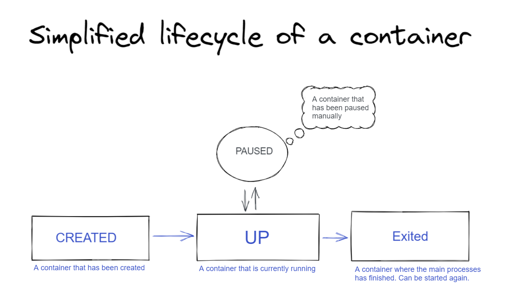

# Why some container exit immediately



## docker container exit when main process exit
A docker container exits when its main process finishes. Containers main purpose is to run process or processes inside an isolated environment.
So when those process finishes, it gets stopped. Unlike let’s say a VM, containers are efficient. So they won’t stay around if all the processes finishes.
That said, because we run database or web servers inside the container. They are long living processes, so if you run any of those long-running process you will see it won’t get stopped.
Normally, developers don’t run into issues like this. But for some cases, you may need the containers to keep running.

## how to prevent docker container exit

- Implement with docker compose

```yml
version: 1.0.0

services:
  phil-ubuntu-compose:
    image: ubuntu:trusty
    stdin_open: true # docker run -i
    tty: true        # docker run -d
```

- Implement with `docker run`

```bash
docker run -dti \
	--name phil-ubuntu \
	ubuntu:trusty
```
ssh onto the container
```shell
docker exec -it <container name> bash
```


> Reference 
- https://sab-exp.medium.com/how-to-keep-the-docker-container-running-if-it-stops-immediately-9521c179bb43