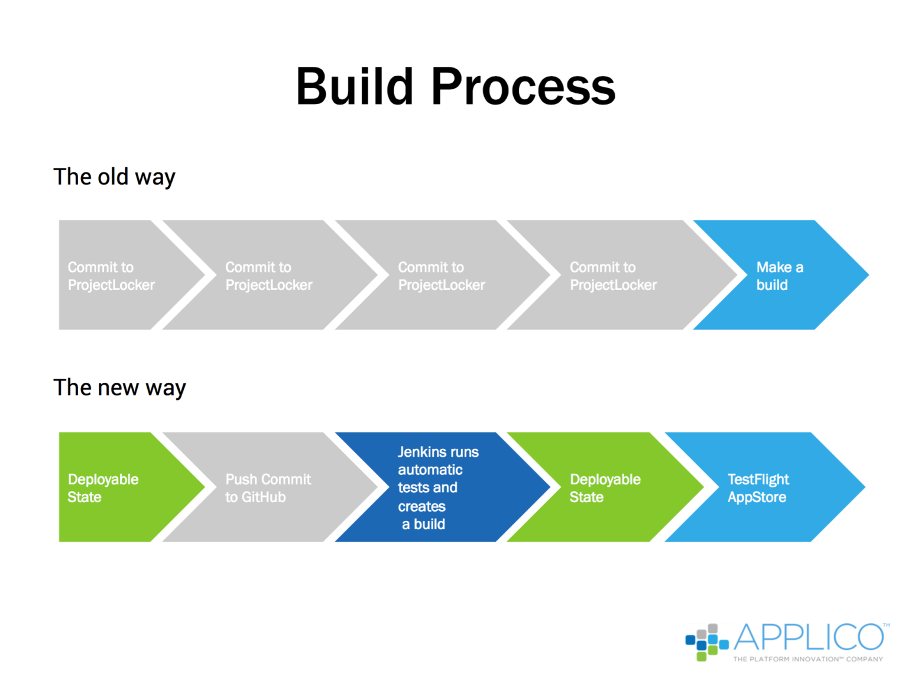
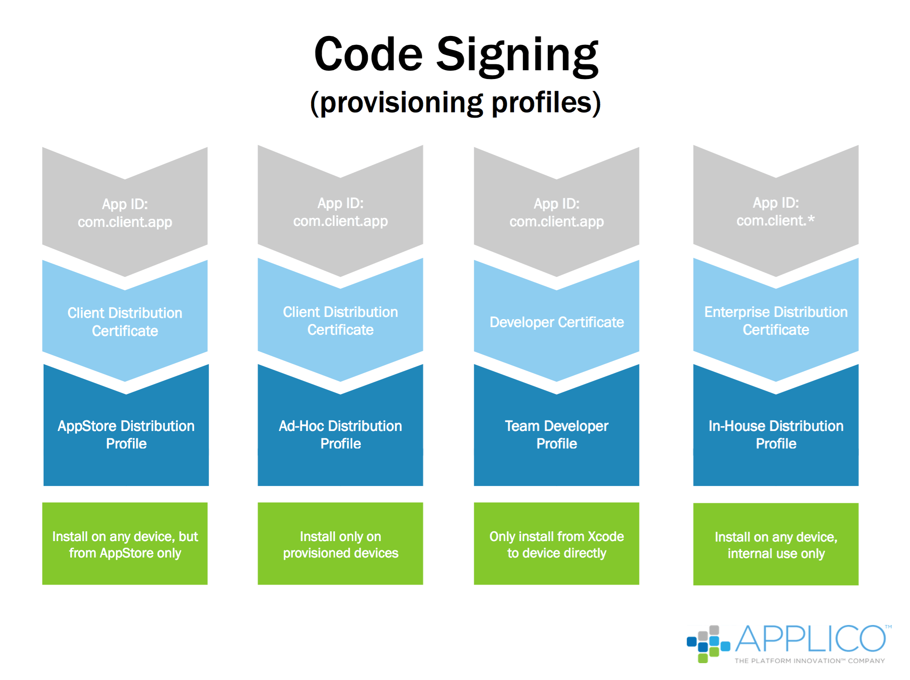
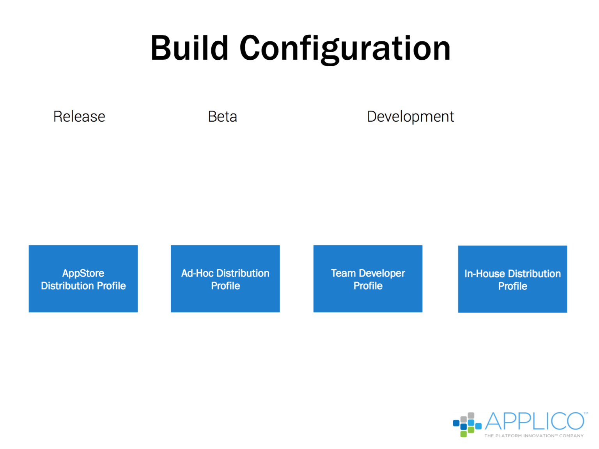
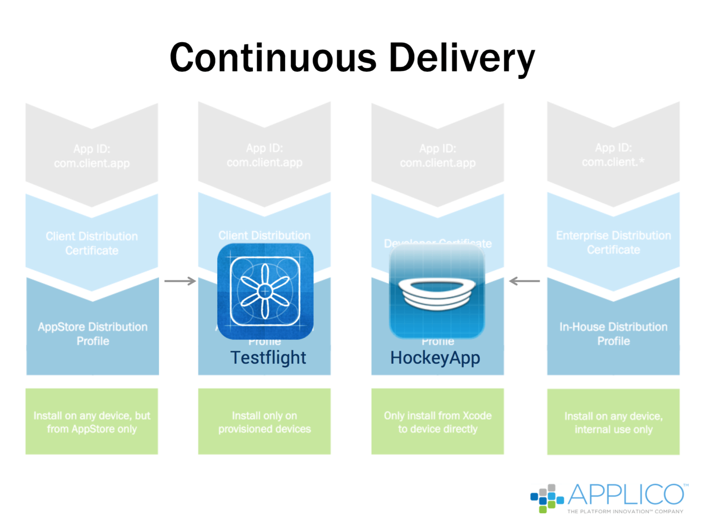

# iOS Mobile App Development Guide: Best Practices for Building iPhone Mobile Apps

> Essentially, the first step in this new process is to create an initial, completed build that exists in the desired deployable state. Developers continue working on the project and regularly push their code to GitHub, a code repository. Jenkins, a continuous integration system, interacts with the code on GitHub, conducting automated testing on the code as it’s uploaded and creating builds to ensure that the app functions when the new and changed code is committed.

> This loop continues throughout the life of the project. Developers pull down builds of the code and establish their own branches, make their changes, and then push the code back into the master branch, where it’s immediately tested. This process is repeated continuously, and the app is thus maintained in a deployable state where a build always exists that’s been tested and is ready to deploy as one of a number of build types.

> The build process including five parts.
  - Code Signing
  - Build Configuration
  - Continuous Integration
  - Continuous Delivery
  - Automation

## Code Signing
> Code signing is the process of assigning specific profiles to builds that can then be distributed for specific purposes, with how a profile is signed determining how the code will be used. Profiles include:

  - Team developer distribution profile: used for writing and editing code. These builds can only be installed from Xcode directly to devices.
  - Ad hoc distribution profile: provided to testers for quality assurance testing. These builds can only be installed on specially provisioned devices, specifically those test devices that are registered with Apple.
  - AppStore distribution profile: used to provide a build for acceptance into the App Store. Only certain developers can be assigned to app builds created for this purpose, and only apps signed with the AppStore distribution profile can be submitted to the App Store.
  - Enterprise distribution profile: creates builds that can be used on any device, but that are only available for internal use.

> These build profiles are maintained on Apple’s developer portal and given an app ID. Developers then know to access these builds for specific purposes by the combination of the app ID and the distribution profile. Apps typically use the first three profiles, and often use all four.

## Build Configuration
> Build configuration is simply the process of creating app builds that are signed for specific uses. Because an app is maintained in a continuously deployable state, a build generated for any purposes always represents the latest version with the most up-to-date and tested code.

## Continuous Integration

> Jenkins provides Applico with the ability to implement continuous integration, which is basically automating the build management process. Whenever a developer merges new code into the codebase on GitHub, Jenkins immediately tests the code to ensure that no syntax or other errors exist and that the code is capable of running without error.

> The test results are communicated back to the developer. These will state whether the app ran without issue or issues exist that require fixing. Tests are run after each debugging iteration until the app runs without issue and is committed into the master codebase for generating builds. This prevents the master code base from being contaminated with improper code.

## Continuous Delivery

> Once builds have been tested, they are uploaded into the continuous delivery service, either Testflight for App Store profile builds or HockeyApp for ad-hoc, developer, and enterprise profile (i.e., internal) builds. The continuous delivery service acts as the portal through which builds are downloaded as needed. Continuous delivery is the process by which Applico prevents deployment lag, as discussed earlier.

## Automation
> Automation is simply a description of the overall process, including the communication and verification that ensures that all code has been tested, reviewed, and documented.  The automation phase incorporates additional tools, including Applico’s project management tool, Pivotal Tracker. This tool manages the overall workflow, assigning tasks to developers, tracking their progress, and allowing developers to provide comments for each code revision. GitHub works through Pivotal Tracker to merge each revision into the overall codebase in a fully documented state.

> The basic process is as follows. Whenever developers make changes and are ready to merge the changes back into the main codebase, they open pull requests on GitHub. Snapshots of the code changes are provided, along with developer comments. This process provides all developers the opportunity to take part in a conversation around changes, evaluating each change and then triggering merges after the appropriate reviews.

